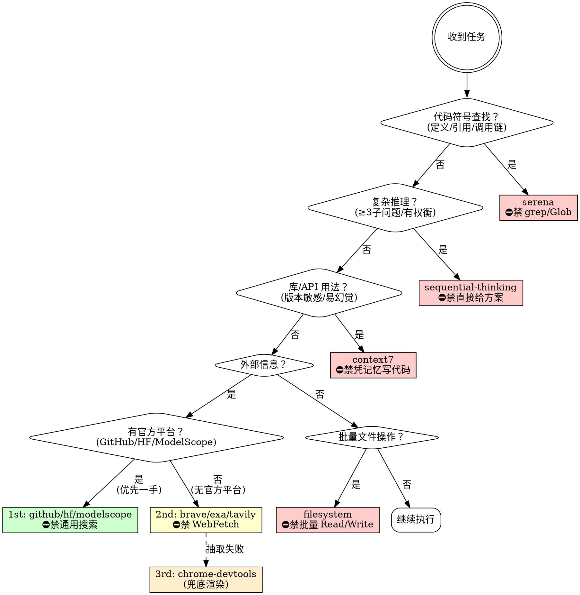

# MCP 工具编排器

> **核心职责**：根据任务特征路由到正确的 MCP 工具，强制证据驱动输出，防止盲写代码与幻觉 API。

---

## 📋 立即行动（看到这里直接执行）

**这是你被触发后的第一件事：**

1. **停止默认行为**：不要直接用 WebSearch/Grep/Read，先看下面的检查表
2. **快速匹配**：在"快速触发检查"表中找到匹配项
3. **调用 MCP 工具**：按照表中的"必须调用"列执行
4. **输出自检段落**：完成后必须包含"MCP 工具选择自检"（见"输出契约"）

**如果不确定用哪个工具 → 优先用 `sequential-thinking` 分解任务，再决定。**

---

## ⚡ 快速触发检查（优先级最高）

**在执行任何操作前，必须先自检：**

| 用户请求是否包含...                                    | 必须调用                     | 禁止使用            |
| ------------------------------------------------------ | ---------------------------- | ------------------- |
| "官方渠道/官方文档/ModelScope/HuggingFace/GitHub 仓库" | `github`/`hf-mcp-server` MCP | WebSearch/WebFetch  |
| "模型/API/库的参数/样例/用法"                          | `context7` MCP               | 凭记忆写代码        |
| "代码符号/定义位置/调用链/影响面"                      | `serena` MCP                 | grep/find/Glob/Grep |
| "复杂分析/多子问题/有权衡"                             | `sequential-thinking` MCP    | 直接给结论          |

**违规成本**：错误的工具选择会导致幻觉 API、信息噪声、重复劳动。

---

## 🚨 四大铁律（违反立即拒绝）

1. **禁止盲写**：代码符号问题必须先用 `serena`（符号定位 → 调用链 → 影响面）
   ❌ **错误示例**：直接用 grep 搜索类名 → ✅ **正确做法**：`mcp__serena__find_symbol`

2. **禁止幻觉 API**：库/框架用法必须先用 `context7` 或一手文档验证
   ❌ **错误示例**：凭记忆写 `AutoModel.from_pretrained()` → ✅ **正确做法**：`mcp__context7__query-docs`

3. **禁止跳跃结论**：复杂问题（≥3 子问题/存在权衡）必须先用 `sequential-thinking` 分解
   ❌ **错误示例**：直接给优化方案 → ✅ **正确做法**：`mcp__sequential-thinking__sequentialthinking`

4. **禁止无证据输出**：外部事实必须有来源链（优先官方/一手），时间敏感结论需双来源互证
   ❌ **错误示例**：用 WebSearch 获取模型文档 → ✅ **正确做法**：`mcp__hf-mcp-server__hub_repo_details` + `mcp__hf-mcp-server__model_search`

---

## 路由决策图



---

## 快速参考表

| 任务特征                                | 必须用                                    | 禁止用                  | 核心差异                      |
| --------------------------------------- | ----------------------------------------- | ----------------------- | ----------------------------- |
| 代码符号（定义/引用/调用链/影响面）     | `serena`                                  | grep/find/Glob/Grep     | 符号语义 vs 文本匹配          |
| 复杂推理（≥3 子问题/存在权衡/约束不清） | `sequential-thinking`                     | 直接给方案/自行分析     | 结构化分解 vs 跳跃结论        |
| 库/API 用法（版本敏感/易幻觉 API）      | `context7`                                | 凭记忆写代码            | 版本正确性 vs 幻觉            |
| **外部信息 - 官方平台（1st 优先）**     | **`github`/`hf-mcp-server`/`modelscope`** | **通用搜索/手动拼 URL** | **官方 API（结构化）vs 噪声** |
| **外部信息 - 通用搜索（2nd 兜底）**     | **`brave-search`/`exa`/`tavily-remote`**  | **WebFetch/WebSearch**  | **证据链 + 抽取 vs 单次获取** |
| **外部信息 - 浏览器（3rd 兜底）**       | **`chrome-devtools`**                     | **放弃获取**            | **渲染（反爬）vs 抽取失败**   |
| 批量文件操作（配置变更/目录管理）       | `filesystem`                              | 批量 Read/Write/Edit    | 原子性 + dryRun 预览          |

**工具组合策略**：

- **外部信息检索**：官方平台（github/hf/modelscope，一手来源）→ 通用搜索（brave → exa → tavily，广覆盖 → 精筛 → 抽取）→ 浏览器兜底（chrome-devtools，反爬/动态渲染）
- **代码开发**：serena（定位）+ context7（验证 API）+ filesystem（最小改动 + dryRun）

---

## 输出契约（每次必须包含）

### 模板

```markdown
---
🔍 MCP 工具选择自检

- [x] 已检查决策树：命中节点 <qX>（<任务特征>）
- [x] 已选择 MCP 工具：<工具名>（理由：<简短说明>）
- [x] 已避免违规操作：未使用 <禁止工具>

**工具调用链：**
1. <tool_1> - <目的>
2. <tool_2> - <目的>
...

**关键证据来源：**
- 代码符号：<file:line> / <symbol_name>（若适用）
- 外部文档：<来源类型> / <版本/日期>（若适用）
- 推理过程：<sequential-thinking 分解结果>（若适用）
---
```

### 实际示例

**场景：用户请求"从 ModelScope 获取 FunASR 模型文档"**

```markdown
---
🔍 MCP 工具选择自检

- [x] 已检查决策树：命中节点 q4a（外部信息 - 官方平台）
- [x] 已选择 MCP 工具：`modelscope` MCP（理由：ModelScope 是一手官方平台）
- [x] 已避免违规操作：未使用 WebSearch/WebFetch

**工具调用链：**
1. `mcp__modelscope__search_models` - 搜索 FunASR 相关模型
2. `mcp__hf-mcp-server__hub_repo_details` - 获取模型详细参数

**关键证据来源：**
- 外部文档：ModelScope API / 2025-02-04
---
```

⚠️ **强制要求**：回复中必须包含上述自检段落，否则回答无效。

---

## 容错降级路径

| 工具失败                              | 降级方案                                                                                        | 输出说明                                               |
| ------------------------------------- | ----------------------------------------------------------------------------------------------- | ------------------------------------------------------ |
| `serena`                              | 1. 先调用 `activate_project`（YiVideo）<br>2. 激活后**立即重试**原操作<br>3. 仍失败 → 降级 Grep | "serena 不可用，降级到文本搜索（无符号级定位）"        |
| `context7`                            | brave-search（官方文档）+ tavily-remote 抽取                                                    | "context7 不可用，使用 Web 检索兜底"                   |
| `github`/`hf-mcp-server`/`modelscope` | 降级到 brave-search（"平台名 <查询>"）+ tavily 抽取官方页面                                     | "官方 MCP 不可用，降级通用搜索"                        |
| `exa`                                 | brave-search + tavily-remote                                                                    | "exa 不可用，使用 brave + tavily 兜底"                 |
| `tavily-remote`                       | 1. 尝试 chrome-devtools 浏览器渲染<br>2. 仍失败 → brave/exa 给出来源列表 + 手动摘要             | "通过浏览器渲染获取" 或 "未抽取原文，基于来源列表摘要" |

---

## 特殊约束

### serena 项目激活（硬规则）

若 serena 返回 `"No active project"`：

1. **必须先调用** `mcp__serena__activate_project`（项目名：YiVideo）
2. 激活后**立即重试**原始 serena 操作（不得跳过）
3. **严禁**在未激活的情况下放弃使用 serena

### 合理例外（可使用内置工具）

以下情况可不使用 MCP 工具：

1. **用户明确指定**："用 grep 找..."（遵从指令，输出说明"按用户要求使用 <工具>"）
2. **MCP 服务器不可用** 且无降级路径（输出说明"<MCP 工具> 不可用，降级使用 <内置工具>"）
3. **非代码语义的文本搜索**：在日志/文档中搜索纯文本模式（非符号）
4. **快速原型/一次性脚本**：无需符号级定位（输出说明"非生产代码，未做符号级验证"）

---

## 📚 详细参考（按需加载）

复杂场景或需要调用模板时，请阅读：

- `@references/server-details.md`：每个 MCP server 的详细能力与调用模板
- `@references/workflow-examples.md`：6 种工作流模式示例（代码开发/查最新用法/Web 研究/文件批处理/模型选型/GitHub 研究）
- `@references/anti-patterns.md`：反模式案例库（盲写/幻觉 API/跳跃结论的具体案例）
