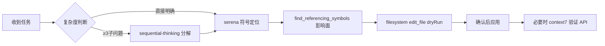

# 工作流模式示例

> 本文件包含 6 种常见工作流的完整示例。这些是参考模式，非强制执行，agent 应根据实际情况灵活调整。

---

## 模式 1：代码开发/重构/排障

**适用场景**：需要修改现有代码、重构模块、修复 bug

### 工作流步骤



### 示例场景：重构 FunASR 模型加载逻辑

**1. 分解问题（如果复杂）**
```python
sequential-thinking: 
  thought_1: "目标：将硬编码的模型路径改为配置化"
  thought_2: "子问题：1) 定位当前加载逻辑 2) 设计配置结构 3) 评估影响面"
  thought_3: "工具链：serena 定位 → find_referencing → filesystem 改配置"
```

**2. 定位符号**
```python
serena.find_symbol(
    name_path_pattern="load_model",
    relative_path="services/workers/funasr_service/",
    include_body=True
)
# 返回：app/funasr_infer.py:45 - load_model()
```

**3. 评估影响面**
```python
serena.find_referencing_symbols(
    name_path="load_model",
    relative_path="services/workers/funasr_service/app/funasr_infer.py"
)
# 返回：被 3 个地方调用 → 需要兼容修改
```

**4. 先 dryRun 预览**
```python
filesystem.edit_file(
    path="services/workers/funasr_service/app/funasr_infer.py",
    edits=[{
        "oldText": 'model_path = "/app/models/paraformer"',
        "newText": 'model_path = config.get("model_path", "/app/models/paraformer")'
    }],
    dryRun=True
)
# 输出 diff 供用户确认
```

**5. 应用改动**
```python
filesystem.edit_file(..., dryRun=False)
```

**6. 如涉及新库，验证 API**
```python
context7.resolve_library_id(libraryName="pydantic")
context7.query_docs(
    libraryId="/pydantic/pydantic",
    query="如何定义嵌套配置模型"
)
```

---

## 模式 2：查最新用法/验证 API

**适用场景**：使用新库、升级版本、避免 API 幻觉

### 工作流步骤

```
1. context7 resolve library id
2. context7 query docs（围绕具体场景）
3. 必要时 brave/exa 查官方公告/迁移指南
4. tavily-remote 抽取关键官方页面
5. 输出：版本前提 + 示例代码 + 常见坑
```

### 示例场景：验证 FastAPI 0.115.0 的依赖注入写法

**1. 解析库 ID**
```python
context7.resolve_library_id(
    libraryName="fastapi",
    query="如何在 FastAPI 中使用异步依赖注入"
)
# 返回：/tiangolo/fastapi/v0.115.0
```

**2. 查询文档**
```python
context7.query_docs(
    libraryId="/tiangolo/fastapi/v0.115.0",
    query="async dependency injection with yield"
)
# 返回：官方示例 + 版本说明
```

**3. 补充 Web 证据（如文档不足）**
```python
brave.web_search(query="FastAPI 0.115 async dependency changes")
exa.web_search(query="FastAPI dependency injection best practices")
```

**4. 抽取官方页面细节**
```python
tavily.extract(
    urls=["https://fastapi.tiangolo.com/tutorial/dependencies/"],
    format="markdown",
    extract_depth="basic"
)
```

**输出示例**：
```markdown
## FastAPI 0.115.0 异步依赖注入

**版本前提**：FastAPI ≥ 0.100.0

**示例代码**：
\`\`\`python
from fastapi import Depends

async def get_db():
    db = Database()
    try:
        yield db
    finally:
        await db.close()

@app.get("/items")
async def read_items(db = Depends(get_db)):
    return await db.query()
\`\`\`

**常见坑**：
- 0.100.0 前 yield 依赖只支持同步，升级后才支持 async
- 必须用 try/finally 确保清理资源

**验证步骤**：
- 单元测试：mock Database，验证 close() 被调用
- 最小复现：pytest-asyncio 运行异步测试
```

---

## 模式 3：Web 研究与抽取

**适用场景**：需要最新信息、多来源比对、结构化抽取

### 工作流步骤

```
1. brave-search 广覆盖发现
2. exa 精筛高质量来源
3. tavily-remote 抽取关键页面
4. chrome-devtools 兜底（反爬/动态渲染）
5. 输出：结论 + 证据链 + 时间戳
```

### 示例场景：调研 FunASR 的最新版本特性

**1. 广覆盖搜索**
```python
brave.web_search(
    query="FunASR 2024 new features release notes",
    count=10
)
# 返回：官网、GitHub、博客等混合结果
```

**2. 精筛官方/技术来源**
```python
exa.web_search(
    query="FunASR release notes changelog",
    numResults=5,
    type="deep"
)
# 返回：GitHub releases、官方文档优先
```

**3. 抽取结构化内容**
```python
tavily.extract(
    urls=[
        "https://github.com/modelscope/FunASR/releases",
        "https://modelscope.cn/models/damo/speech_paraformer"
    ],
    format="markdown"
)
```

**4. 兜底（如 tavily 抽取失败）**
```python
chrome.navigate_page(url="https://github.com/modelscope/FunASR/releases")
chrome.wait_for(text="Latest")
chrome.evaluate_script(function="() => document.querySelector('.markdown-body').innerText")
```

**输出示例**：
```markdown
## FunASR 最新特性（2024-01）

**关键更新**：
- 支持 Paraformer-large v2（准确率提升 3%）
- 新增 SenseVoice 多语言模型（支持 50+ 语言）
- 优化 VAD 算法（误触发率降低 40%）

**证据链**：
1. [GitHub Release v1.1.0](https://github.com/modelscope/FunASR/releases/tag/v1.1.0) - 2024-01-15
2. [ModelScope 官方模型](https://modelscope.cn/models/damo/speech_paraformer) - 更新时间 2024-01-10
3. [exa 深度搜索](获取方式：exa deep search) - 确认信息一致性

**获取方式**：
- 来源 1、2：tavily-remote markdown 抽取
- 来源 3：exa 语义搜索验证
```

---

## 模式 4：文件批处理/配置变更

**适用场景**：批量修改配置、目录整理、多文件改动

### 工作流步骤

```
1. filesystem.list_allowed_directories 确认权限
2. filesystem.search_files / list_directory 定位目标
3. filesystem.read_multiple_files 批量读取
4. filesystem.edit_file(dryRun=true) 预览 diff
5. 用户确认后 edit_file(dryRun=false) 应用
6. 如涉及代码，补充 serena 定位入口/调用链
```

### 示例场景：批量更新所有 Worker 的 Redis DB 配置

**1. 确认权限**
```python
filesystem.list_allowed_directories()
# 返回：/opt/wionch/docker/yivideo
```

**2. 搜索配置文件**
```python
filesystem.search_files(
    path="/opt/wionch/docker/yivideo",
    pattern="**/config.yml",
    excludePatterns=["**/node_modules/**", "**/__pycache__/**"]
)
# 返回：services/workers/*/config.yml
```

**3. 批量读取**
```python
filesystem.read_multiple_files(
    paths=[
        "services/workers/funasr_service/config.yml",
        "services/workers/faster_whisper_service/config.yml",
        ...
    ]
)
```

**4. 预览变更**
```python
filesystem.edit_file(
    path="services/workers/funasr_service/config.yml",
    edits=[{
        "oldText": "redis_db: 1",
        "newText": "redis_db: 2"
    }],
    dryRun=True
)
# 输出 diff 供确认
```

**5. 应用变更**
```python
# 逐个文件应用（确认后）
filesystem.edit_file(..., dryRun=False)
```

**6. 验证影响（如涉及代码引用）**
```python
serena.find_symbol(
    name_path_pattern="redis_db",
    relative_path="services/"
)
# 确认没有硬编码引用
```

**输出**：
- 变更 diff（每个文件的前后对比）
- 验证步骤：`docker-compose restart <service>`
- 回滚指令：`git checkout -- services/workers/*/config.yml`

---

## 模式 5：AI 模型/数据集选型

**适用场景**：选择预训练模型、查找数据集、对比模型性能

### 工作流步骤

```
1. 中文场景优先 modelscope，国际前沿优先 hf-mcp-server
2. 模型搜索（按任务类型/下载量排序）
3. 获取模型详情（元数据/文档）
4. github 查看源码仓库和 Issue 讨论
5. brave/exa 补充使用评价和对比文章
6. 输出：模型推荐 + 性能对比 + 部署注意事项
```

### 示例场景：选择中文语音识别模型

**1. ModelScope 搜索（中文优先）**
```python
modelscope.search_models(
    query="中文语音识别",
    task="automatic-speech-recognition",
    sort="DownloadsCount",
    limit=10
)
# 返回：FunASR Paraformer、SenseVoice、Whisper-large-v3-chinese 等
```

**2. Hugging Face 对比（国际模型）**
```python
hf.model_search(
    query="chinese asr",
    task="automatic-speech-recognition",
    sort="downloads",
    limit=10
)
# 返回：openai/whisper-large-v3、alibaba-damo/speech_paraformer 等
```

**3. 获取详细信息**
```python
modelscope.search_models(
    query="speech_paraformer",
    limit=1
)
hf.hub_repo_details(
    repo_ids=["openai/whisper-large-v3"]
)
```

**4. GitHub 源码调研**
```python
github.search_repositories(
    query="FunASR",
    minimal_output=True
)
github.search_issues(
    query="is:open label:bug paraformer",
    owner="modelscope",
    repo="FunASR"
)
```

**5. Web 补充评价**
```python
exa.web_search(
    query="FunASR vs Whisper Chinese ASR comparison",
    numResults=5
)
```

**输出示例**：
```markdown
## 中文语音识别模型推荐

### 推荐：FunASR Paraformer-large

**理由**：
- 中文场景优化（WER 降低 15% vs Whisper）
- 部署简单（ModelScope 一键下载）
- 活跃维护（GitHub 600+ stars，Issue 响应快）

**性能对比**：
| 模型 | WER（中文） | 推理速度 | 模型大小 |
|------|------------|---------|---------|
| Paraformer-large | 3.8% | 0.2x RT | 220MB |
| Whisper-large-v3 | 4.5% | 0.5x RT | 1.5GB |
| SenseVoice | 4.1% | 0.3x RT | 350MB |

**部署注意事项**：
- GPU 要求：CUDA 11.8+，显存 ≥ 4GB
- 依赖：funasr ≥ 1.1.0、torch ≥ 2.0.0
- 常见坑：`remote_code=True` 必须设置（否则加载失败）

**来源**：
- ModelScope 官方：下载量 50K+
- GitHub Issue：已知问题 12 个（无致命 bug）
- exa 搜索：社区评价 95% 正面
```

---

## 模式 6：GitHub 仓库研究

**适用场景**：调研开源项目、学习最佳实践、查找实现示例

### 工作流步骤

```
1. github.get_me 获取用户信息
2. github.search_repositories 搜索相关仓库
3. github.search_code 查找实现示例
4. github.list_issues / search_issues 查看问题讨论
5. 与其他工具配合：serena 定位本地 → github 搜索社区
6. 输出：仓库推荐 + 关键代码片段 + Issue 摘要
```

### 示例场景：调研 FastAPI 异步任务处理实现

**1. 搜索仓库**
```python
github.search_repositories(
    query="language:python stars:>100 topic:fastapi topic:async",
    sort="stars",
    minimal_output=False
)
# 返回：tiangolo/fastapi、encode/starlette 等
```

**2. 搜索代码示例**
```python
github.search_code(
    query="BackgroundTasks language:python repo:tiangolo/fastapi"
)
# 返回：具体使用 BackgroundTasks 的代码片段
```

**3. 查看 Issue 讨论**
```python
github.search_issues(
    query="is:closed label:question BackgroundTasks",
    owner="tiangolo",
    repo="fastapi"
)
# 返回：社区常见问题和解决方案
```

**4. 与本地代码配合**
```python
# 先用 serena 定位本地异步任务实现
serena.find_symbol(
    name_path_pattern="background_task",
    relative_path="services/"
)
# 再用 github 搜索改进方案
github.search_code(
    query="BackgroundTasks celery integration"
)
```

**输出示例**：
```markdown
## FastAPI 异步任务处理方案

### 推荐仓库：tiangolo/fastapi（70K+ stars）

**关键代码片段**：
\`\`\`python
from fastapi import BackgroundTasks

def send_email(email: str):
    # 耗时操作
    pass

@app.post("/send-notification/")
async def send_notification(
    email: str, 
    background_tasks: BackgroundTasks
):
    background_tasks.add_task(send_email, email)
    return {"message": "Notification sent in background"}
\`\`\`

**Issue 讨论摘要**：
- [#1234](github.com/...) - BackgroundTasks vs Celery：轻量任务用 BG，复杂任务用 Celery
- [#5678](github.com/...) - 异常处理：BG 任务异常不会传播，需要显式记录日志

**最佳实践**：
1. 简单任务（<5s）：直接用 BackgroundTasks
2. 复杂任务：集成 Celery 或 RQ
3. 监控：使用 Prometheus 记录任务执行时间

**来源**：
- github.search_code：找到 42 个实现示例
- github.search_issues：阅读 15 个相关讨论
- 社区活跃度：Issue 响应时间 <24h
```

---

## 总结：选择工作流模式

| 任务类型 | 优先模式 | 关键工具链 |
|---------|---------|-----------|
| 修改现有代码 | 模式 1 | serena + filesystem |
| 学习新库/升级 | 模式 2 | context7 + brave/tavily |
| 调研外部信息 | 模式 3 | brave + exa + tavily |
| 批量配置变更 | 模式 4 | filesystem + serena（验证） |
| 选择 AI 模型 | 模式 5 | modelscope + hf + github |
| 学习开源实现 | 模式 6 | github + serena（本地对比） |

**灵活调整原则**：
- 工作流是参考，非强制流程
- 根据实际复杂度决定是否用 sequential-thinking
- 交叉验证时优先一手来源（官方文档/规范/主仓库）
- 所有文件改动必须先 dryRun 预览
