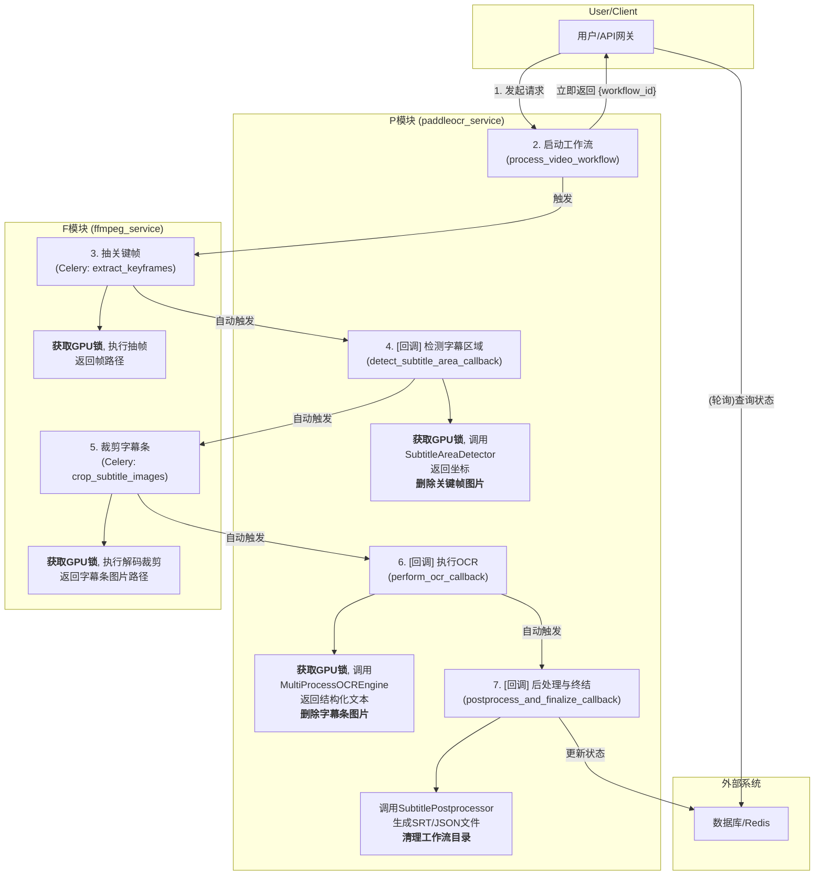

# 异步管道模型与分布式GPU锁设计文档 (最终版)

本文档根据项目代码分析最终确认，详细阐述了在P模块与F模块集成过程中，实现高效、健壮的跨服务协作的“异步管道模型”，以及解决单GPU资源竞争的“分布式GPU锁”方案。

---

## 1. 分布式GPU并发锁设计方案

由于P模块和F模块是独立的Docker容器（即独立的进程），我们需要一个所有服务都能访问的**分布式锁**来确保GPU资源在同一时间只被一个任务占用。

**核心技术选型：使用Redis实现分布式锁。**

Redis通常已作为Celery的Broker或Backend存在于技术栈中，其提供的原子操作（如`SETNX`）是实现分布式锁的理想工具。

### 设计思路

1.  **锁的标识**: 为每个需要同步访问的GPU创建一个唯一的Redis键。例如，`gpu_lock:0` 代表第一张（索引为0）显卡的锁。

2.  **获取锁 (Acquire)**:
    *   任何需要使用GPU的Celery任务（F模块的解码或P模块的OCR），在执行核心逻辑前，都必须先尝试获取锁。
    *   通过Redis的原子命令 `SET key value NX PX milliseconds` 实现。
        *   `NX`: 仅当键（锁）不存在时才设置成功，确保原子性。
        *   `PX`: 为锁设置一个**超时时间**（例如：5分钟）。这是为了防止任务异常崩溃导致锁无法释放，从而避免整个系统被死锁。

3.  **处理锁竞争 (Contention)**:
    *   如果任务获取锁失败（因为锁已被其他任务持有），它**绝不能原地阻塞等待**。
    *   正确的做法是：**利用Celery的任务重试机制**。任务应立即结束本次执行，并请求Celery在几秒后（例如`countdown=5`）重新尝试执行该任务。这通过 `raise self.retry(...)` 实现。

4.  **释放锁 (Release)**:
    *   任务完成GPU操作后，**必须**在 `finally` 代码块中删除Redis中的锁键。这确保了无论任务成功还是失败，只要进程没有被强制杀死，锁都会被可靠地释放。

### 实现策略 (伪代码)

通过Python装饰器封装此逻辑，可以极大地简化任务代码。

```python
# services/common/locks.py (可被P和F共享的通用模块)
import redis
from functools import wraps
from celery import Task

redis_conn = redis.Redis(...) # 全局Redis连接

class GpuLockException(Exception):
    pass

def gpu_lock(lock_key="gpu_lock:0", timeout=300 * 1000):
    def decorator(func):
        @wraps(func)
        def wrapper(*args, **kwargs):
            task_instance = args[0]
            if not isinstance(task_instance, Task):
                raise TypeError("This decorator must be used on a Celery Task method.")

            # 1. 尝试获取锁
            if redis_conn.set(lock_key, task_instance.request.id, nx=True, px=timeout):
                try:
                    # 2. 获取成功, 执行任务
                    return func(*args, **kwargs)
                finally:
                    # 3. 最终释放锁
                    redis_conn.delete(lock_key)
            else:
                # 4. 获取失败, 触发Celery重试
                raise task_instance.retry(exc=GpuLockException("Failed to acquire GPU lock"), countdown=5)
        return wrapper
    return decorator

# --- 在F模块和P模块的任务中这样使用 ---
@app.task(bind=True)
@gpu_lock(lock_key="gpu_lock:0")
def some_gpu_task(self, ...):
    # 这里的代码现在是GPU访问安全的
    pass
```

---

## 2. “异步管道模型”工作流程详解 (代码分析修正版)

该模型的核心思想是：**彻底杜绝阻塞式等待 (`task.get()`)**，将整个视频处理流程看作是一条由多个独立的、自动触发的Celery任务组成的流水线。

### 核心组件

*   **Workflow ID**: 在流程开始时生成的唯一ID，用于追踪整个端到端的处理过程。
*   **任务链 (Chain)**: 一系列预先定义好的、按顺序执行的Celery任务。前一个任务的输出会自动成为后一个任务的输入。
*   **共享存储 (Shared Volume)**: 一个所有Docker容器都能读写的目录，用于存储中间产物。
*   **状态追踪 (State Tracking)**: 一个外部系统（如Redis或数据库），用于记录每个`Workflow ID`的当前状态。

### 流程图 (最终版)



### 分步解析 (最终版)

1.  **[P模块: 入口] `process_video_workflow`**: 接收用户请求，生成`workflow_id`，构建并启动包含以下所有步骤的Celery任务链，然后立即返回`workflow_id`。

2.  **[F模块: GPU任务] `extract_keyframes`**: 此Celery任务包装`video_decoder.py`中的`extract_random_frames`函数。它**获取GPU锁**，为区域检测高效抽取少量关键帧，然后返回这些帧的路径。

3.  **[P模块: 回调任务] `detect_subtitle_area_callback`**: 接收上一步的帧路径。它首先**获取GPU锁**，然后调用`SubtitleAreaDetector`模块来计算出字幕的精确坐标。**任务结束时，它负责删除这些已使用过的关键帧图片**，然后将计算出的坐标返回给任务链。

4.  **[F模块: GPU并发任务] `crop_subtitle_images`**: 此Celery任务包装`video_decoder.py`中的`decode_video_concurrently`函数。它接收原始视频路径和上一步的坐标，**获取GPU锁**，在内部实现视频分块和并发解码，高效地裁剪出所有字幕条图片。完成后，返回这些字幕条图片的路径列表。

5.  **[P模块: 回调任务&GPU任务] `perform_ocr_callback`**: 接收上一步的字幕条图片路径。它首先**获取GPU锁**，然后调用`MultiProcessOCREngine`来并发处理这些图片，执行OCR。**任务结束时，它负责删除这些已使用过的字幕条图片**，然后将带时间戳的结构化OCR结果返回给任务链。

6.  **[P模块: 回调任务] `postprocess_and_finalize_callback`**: 接收结构化的OCR结果。它调用`SubtitlePostprocessor`模块，该模块会执行`_merge_duplicate_subtitles`逻辑来合并相似字幕，并最终生成`.srt`和`.json`格式的字幕文件。**最后，此任务负责删除整个工作流的临时目录，并更新数据库中的任务状态为`completed`**，标志着整个流程的结束。
