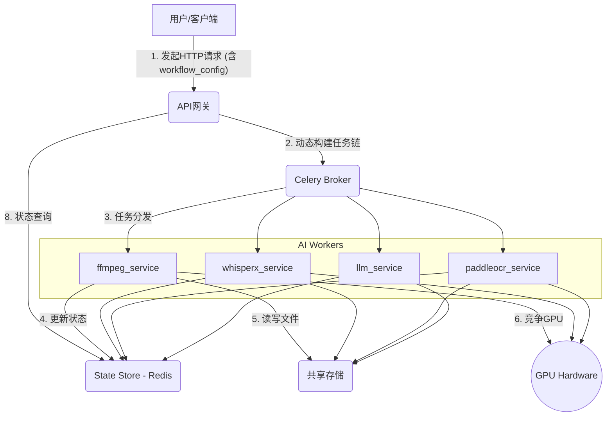

# 系统总体架构设计 (SYSTEM_ARCHITECTURE.md)

**版本**: 1.1
**状态**: 讨论中

## 1. 核心思想：动态工作流引擎

本系统的核心定位是一个**动态、可配置的AI视频处理工作流引擎**。其设计目标是脱离写死的、单一的处理流水线，转向一个能够根据用户需求，灵活地、即插即用地编排组合各种原子化AI功能（如语音识别、OCR、语言模型、文本转语音等）的平台。

系统的驱动力是“**配置而非编码**”。通过一份描述“做什么”和“怎么做”的工作流配置文件，系统应能自动构建并执行一个复杂的处理链条，而无需修改任何服务端的代码。

---

## 2. 架构组件与职责

系统采用标准的微服务架构，各组件职责清晰、独立部署。



- **API网关 (`api_gateway`)**: **系统的总入口和大脑**。
  - 接收用户的HTTP请求，解析`workflow_config`。
  - **动态构建** Celery任务链，并启动工作流。
  - 创建并管理Redis中的工作流状态记录。
  - 提供工作流状态查询接口。

- **AI功能服务 (Workers)**: **系统的“手和脚”**，每个服务都是一个独立的Celery worker。
  - `ffmpeg_service`: 基础视频操作。
  - `whisperx_service`: 语音识别（ASR）。
  - `paddleocr_service`: 光学字符识别（OCR）。
  - `llm_service`: (新) 与大语言模型交互（校对、翻译）。
  - `indextts_service` / `gptsovits_service`: 文本转语音（TTS）。

- **基础设施 (Infrastructure)**:
  - **Celery Broker (Redis)**: 任务消息队列。
  - **State Store (Redis)**: 集中化的工作流JSON状态存储。
  - **共享存储**: 存放所有视频、音频、图片等文件。

---

## 3. 关键设计

### 3.1. API 设计与 `workflow_config`
- **端点**: `POST /v1/workflows`
- **请求体 (Body)**:
  ```json
  {
      "video_path": "/share/videos/input/example.mp4",
      "workflow_config": {
          "subtitle_generation": { "strategy": "asr", "provider": "whisperx" },
          "subtitle_refinement": { "strategy": "llm_proofread", "provider": "gemini" }
      }
  }
  ```

### 3.2. 标准化工作流上下文 (Standardized Workflow Context)
所有任务间传递一个统一的、不断丰富的“工作流上下文”字典。
- **数据结构**:
  ```json
  {
      "workflow_id": "...",
      "input_params": { "video_path": "..." },
      "shared_storage_path": "/share/workflows/...",
      "stages": {
          "subtitle_generation": {
              "status": "SUCCESS",
              "output": { "subtitle_file": "/path/to/raw.srt" }
          },
          "subtitle_refinement": { "status": "PENDING" }
      },
      "error": null
  }
  ```
- **传递方式**: 作为每个Celery任务的唯一参数和返回值。

### 3.3. 标准化任务接口 (Standardized Task Interface)
所有worker中的Celery任务必须遵循统一的函数签名。
- **函数签名**: `def standard_task_interface(self: Task, context: dict) -> dict:`

### 3.4. 分布式GPU锁
采用基于Redis的`@gpu_lock`装饰器，通过`SETNX`原子命令实现，失败则利用`task.retry()`重试。

### 3.5. 状态追踪与持久化
工作流的完整状态记录被持久化在Redis中。
- **键**: `workflow_state:{workflow_id}`
- **值**: 一个详细的JSON对象，记录工作流生命周期。
- **更新**: `api_gateway`创建记录；每个任务执行前后更新自己的状态。
- **过期**: 为每条记录设置可配置的TTL（例如7天）。

---

## 4. 示例工作流：OCR字幕提取

为了具体说明各组件如何协同工作，我们以一个从视频中提取字幕的OCR工作流为例，分解其详细步骤。

1.  **[用户]**: 用户向`api_gateway`的`POST /v1/workflows`端点发起请求，`workflow_config`中指定`"strategy": "ocr"`。

2.  **[API网关: 入口]**: `api_gateway`服务接收到请求。它负责：
    *   生成一个全局唯一的 `workflow_id`。
    *   在Redis中创建初始的状态JSON，并设置TTL。
    *   根据`"strategy": "ocr"`，构建一个Celery任务链: `chain(extract_keyframes.s() | detect_subtitle_area.s() | crop_subtitle_images.s() | perform_ocr.s() | postprocess_and_finalize.s())`。
    *   调用 `.apply_async()` 启动任务链，并将初始的`WorkflowContext`作为参数传入。
    *   立即向用户返回 `workflow_id`。

3.  **[F模块: GPU任务] `extract_keyframes`**: F模块的worker获取任务。
    *   **获取GPU锁**。
    *   为区域检测高效抽取少量关键帧。
    *   更新Redis中的状态记录。
    *   返回包含帧路径的`WorkflowContext`。

4.  **[P模块: 回调任务] `detect_subtitle_area`**: P模块的worker获取任务。
    *   **获取GPU锁**。
    *   调用`SubtitleAreaDetector`计算字幕精确坐标。
    *   **负责删除已用过的关键帧图片**。
    *   更新Redis状态，返回包含坐标的`WorkflowContext`。

5.  **[F模块: GPU并发任务] `crop_subtitle_images`**: F模块的worker获取任务。
    *   **获取GPU锁**。
    *   高效地裁剪出所有字幕条图片。
    *   更新Redis状态，返回包含图片路径列表的`WorkflowContext`。

6.  **[P模块: 回调任务&GPU任务] `perform_ocr`**: P模块的worker获取任务。
    *   **获取GPU锁**。
    *   调用`MultiProcessOCREngine`并发执行OCR。
    *   **负责删除已用过的字幕条图片**。
    *   更新Redis状态，返回包含结构化OCR结果的`WorkflowContext`。

7.  **[P模块: 回调任务] `postprocess_and_finalize`**: P模块的worker获取任务。
    *   接收结构化的OCR结果，进行合并、排序和格式化，生成最终的字幕文件。
    *   **负责删除整个工作流的临时目录**。
    *   将Redis中顶层的`status`更新为`SUCCESS`，并填充`result`字段。
