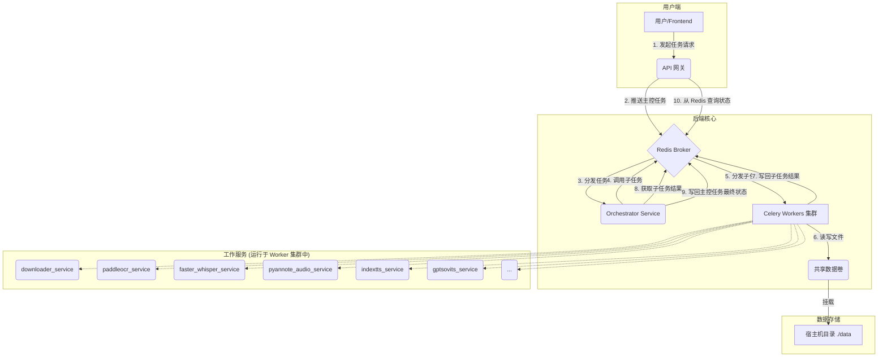

# YiVideo 技术设计文档 (TDD)

## 1. 系统架构

### 1.1. 核心设计原则

系统将基于以下核心原则进行设计，以确保其健壮性、可扩展性和可维护性：

*   **微服务架构 (Microservices)**: 系统功能被拆分为一系列高内聚、低耦合的独立服务，每个服务在独立的 Docker 容器中运行，并拥有独立的依赖。
*   **异步任务驱动 (Asynchronous & Task-Driven)**: 所有耗时操作都将作为异步任务处理。系统采用 **Celery** 作为分布式任务队列框架，**Redis** 作为消息中间件 (Broker) 和结果后端。
*   **工作流编排 (Workflow Orchestration)**: 引入一个专用的 **Orchestrator Service**，负责动态地编排、执行和监控任务流，取代原有的静态任务链，以实现更高的灵活性和错误处理能力。
*   **事件驱动数据流 (Event-Driven Data Flow)**: 服务间不直接传递文件路径，而是通过传递**数据ID**进行解耦。计算服务根据ID从共享数据区获取处理对象，避免了路径依赖和并发读写问题。
*   **集中化数据管理 (Centralized Data)**: 所有持久化数据，包括任务文件和 AI 模型，都存储在宿主机的共享目录中，并通过 Docker Volume 挂载到各容器，确保数据的一致性和持久性。

### 1.2. 架构图



### 1.3. 项目目录结构 (解耦后)

为了支持上述微服务架构，项目将采用清晰、模块化的目录结构。

```
.
├── .env
├── .gitignore
├── docker-compose.yml
├── Dockerfile.base
├── README.md
├── data/
│   ├── models/
│   └── workspace/
├── docs/
│   ├── PRD.md
│   └── SDD.md
├── services/             # 所有微服务的源代码根目录
│   ├── api_gateway/      # API 网关服务 (FastAPI)
│   └── workers/          # Celery Worker 服务集群
│       ├── orchestrator_service/
│       ├── downloader_service/
│       ├── paddleocr_service/      # 新：PaddleOCR 服务
│       ├── faster_whisper_service/ # 新：Faster Whisper ASR 服务
│       ├── pyannote_audio_service/ # 新：Pyannote Audio 说话人分离服务
│       ├── inpainting_service/     # 新：视频修复服务 (STTN/LAMA/PROPAINTER)
│       ├── indextts_service/       # 新：IndexTTS 服务
│       ├── gptsovits_service/      # 新：GPT-SoVITS 服务
│       └── ... (其他 worker, 结构类似)
└── tests/
```

## 2. 组件详解

### 2.1. API 网关 (`api-gateway`)
*   **技术栈**: Python, FastAPI。
*   **职责**: 系统的统一入口，负责认证、路由和请求校验。接收用户请求，调用 `orchestrator_service` 并返回 `task_id`。

### 2.2. 工作流编排器 (`orchestrator_service`)
*   **技术栈**: Python, Celery。
*   **职责**: 任务总指挥。根据用户请求中的 `actions` 列表，动态、顺序地调用其他 Worker 的子任务，并管理整个工作流的状态。

### 2.3. 任务队列 (`celery` + `redis`)
*   **Celery**: 负责任务的定义、分发、执行和状态追踪。
*   **Redis**: 担当 Broker 和 Result Backend 的角色。

### 2.4. 共享数据卷
*   **实现**: 通过 `docker-compose.yml` 的 `volumes` 指令实现，所有数据和服务产出物都在宿主机的 `./data` 目录下，便于访问和管理。

### 2.5. 工作服务 (Celery Workers)

每个AI功能被封装成一个独立的、可按需调用的 Celery Worker 服务。

*   **`downloader_service`**
    *   **职责**: 下载视频文件到共享数据卷，返回数据ID。
    *   **核心依赖**: `yt-dlp`。

*   **`paddleocr_service` (新)**
    *   **职责**: 提供OCR能力，从视频帧中提取硬字幕。
    *   **核心依赖**: `paddleocr`。

*   **`faster_whisper_service` (新)**
    *   **职责**: 提供高效的ASR能力，从音轨中提取语音字幕。
    *   **核心依赖**: `faster-whisper`。
*   **`pyannote_audio_service` (新)**
    *   **职责**: 提供说话人分离能力。
    *   **核心依赖**: `pyannote.audio`。

*   **`inpainting_service` (新)**
    *   **职责**: 去除视频中的硬字幕，对背景进行修复。
    *   **核心依赖**: `STTN`, `LAMA`, `PROPAINTER` 等视频修复算法。

*   **`indextts_service` (新)**
    *   **职责**: 根据文本和参考音频生成目标语音（TTS）。
    *   **核心依赖**: `indextts`。

*   **`gptsovits_service` (新)**
    *   **职责**: 提供另一种高质量的TTS和声音克隆方案。
    *   **核心依赖**: `GPT-SoVITS`。

*   **`translation_service`**
    *   **职责**: 调用大语言模型API翻译字幕文本。
    *   **核心依赖**: `Gemini` / `DeepSeek` API。

*   **`merger_service`**
    *   **职责**: 将处理好的视频、音频、字幕合并成最终文件。
    *   **核心依赖**: `ffmpeg-python`。

## 3. 核心工作流: “视频翻译”任务 (v2.0)

工作流由 `orchestrator_service` 动态驱动，取代了原有的静态 `chain`。

1.  **API 网关** 接收到请求 `POST /tasks`，请求体为 `{ "url": "...", "actions": ["download", "ocr", "translate"], "ocr_params": {"area": null} }`。
2.  网关调用主控任务：`orchestrator.s(request_body).apply_async()`，并立即向用户返回 `task_id`。
3.  **Orchestrator Service** 开始执行主控任务，其内部逻辑如下（伪代码）：
    ```python
    # 伪代码 @ services/workers/orchestrator_service/app/tasks.py
    @app.task(bind=True)
    def orchestrate_workflow(self, user_request):
        task_id = self.request.id
        data_ids = {}
        current_step = ""

        try:
            if "download" in user_request['actions']:
                current_step = "Downloading video"
                self.update_state(state='PROGRESS', meta={'step': current_step})
                # 同步调用子任务，设置超时并等待结果。
                # 注：此处使用 .apply() 同步阻塞调用，是确保工作流按序执行的故意设计。
                result = downloader.s(user_request['url'], task_id).apply(timeout=3600) # 1 hour timeout
                video_id = result.get()
                data_ids['video'] = video_id

            if "ocr" in user_request['actions']:
                current_step = "Extracting subtitles via OCR"
                self.update_state(state='PROGRESS', meta={'step': current_step})
                ocr_params = user_request.get('ocr_params', {})
                result = subtitle_service.s(
                    video_id=data_ids['video'], 
                    task_id=task_id,
                    area=ocr_params.get('area') # 传递用户手动选择的区域
                ).apply(timeout=7200) # 2 hours timeout
                subtitle_id = result.get()
                data_ids['subtitle'] = subtitle_id
            
            # ... 其他步骤，如 translation ...

            return {"status": "SUCCESS", "results": data_ids}

        except Exception as e:
            # 捕获异常，记录详细错误信息并标记任务失败
            error_message = f"Task failed at step: {current_step}. Error: {str(e)}"
            self.update_state(state='FAILURE', meta={'step': current_step, 'error': error_message})
            # 重新引发异常，以便Celery能正确识别任务为失败状态
            raise
    ```
4.  `orchestrator_task` 通过 `update_state` 方法，实时将当前进度（如 `{'step': 'Downloading video'}`）或最终结果/错误写回 Redis，供 API 网关查询。

## 4. 开发与调试

### 4.1. 核心原则: 逻辑分离
*   **业务逻辑**: 必须封装在纯函数或类中，不依赖 Celery 或 FastAPI。例如 `def ocr_video(video_path: str) -> str:`。
*   **服务逻辑**: Celery 的 `@app.task` 或 FastAPI 的 `@app.post` 装饰的函数，负责调用业务逻辑函数。

### 4.2. 调试入口
*   每个服务都必须包含一个 `debug_run.py` 脚本。
*   该脚本可以通过命令行参数接收输入（如文件路径），直接调用核心业务逻辑函数，并打印结果。
*   这允许开发者在不启动整个分布式系统的情况下，对单个功能进行快速测试和调试。
    ```bash
    # 示例
    docker-compose exec subtitle_service python debug_run.py --input /data/workspace/xyz/video.mp4
    ```

## 5. 部署与管理

### 5.1. 部署工具
*   **核心工具**: `Docker Compose`。

### 5.2. Dockerfile 结构
所有服务均基于 `Dockerfile.base` 构建，只在自己的 `Dockerfile` 中添加特定依赖。

**示例: `services/workers/indextts_service/Dockerfile`**
```Dockerfile
# 继承自包含CUDA、Python、FFmpeg等重型依赖的基础镜像
FROM yivideo-base:latest

# 安装该服务特有的系统依赖，例如git
RUN apt-get update && apt-get install -y git && rm -rf /var/lib/apt/lists/*

# 复制源码和依赖定义
WORKDIR /app
COPY ./requirements.txt .

# 安装Python依赖
RUN pip install --no-cache-dir -r requirements.txt

# 克隆并安装 IndexTTS 源码
RUN git clone https://github.com/index-tts/index-tts /opt/indextts
WORKDIR /opt/indextts
RUN pip install -e .

# 下载模型文件
RUN huggingface-cli download IndexTeam/IndexTTS-1.5 --local-dir checkpoints --exclude "*.flac" "*.wav"

# 复制我们自己的Celery task代码
WORKDIR /app
COPY ./app ./app

# 启动命令
CMD ["celery", "-A", "app.celery_app", "worker", "-l", "info", "-Q", "indextts_queue"]
```

### 5.3. `docker-compose.yml` 详解 (示例)

```yaml
version: '3.8'

services:
  redis:
    image: redis:7-alpine
    restart: on-failure

  api_gateway:
    build:
      context: ./services/api_gateway
    # ...

  orchestrator_service:
    build:
      context: ./services/workers/orchestrator_service
    # ...

  # --- AI Worker Services ---

  paddleocr_service:
    build:
      context: ./services/workers/paddleocr_service
    deploy:
      resources:
        reservations:
          devices: [{driver: nvidia, count: 1, capabilities: [gpu]}]
    restart: on-failure

  inpainting_service:
    build:
      context: ./services/workers/inpainting_service
    deploy:
      resources:
        reservations:
          devices: [{driver: nvidia, count: 1, capabilities: [gpu]}]
    restart: on-failure

  faster_whisper_service:
    build:
      context: ./services/workers/faster_whisper_service
  pyannote_audio_service:
    build:
      context: ./services/workers/pyannote_audio_service
    deploy:
      resources:
        reservations:
          devices: [{driver: nvidia, count: 1, capabilities: [gpu]}]
    restart: on-failure

  indextts_service:
    build:
      context: ./services/workers/indextts_service
    deploy:
      resources:
        reservations:
          devices: [{driver: nvidia, count: 1, capabilities: [gpu]}]
    restart: on-failure

  gptsovits_service:
    build:
      context: ./services/workers/gptsovits_service
    deploy:
      resources:
        reservations:
          devices: [{driver: nvidia, count: 1, capabilities: [gpu]}]
    restart: on-failure

  # ... other services

volumes:
  redis_data:
    driver: local
```

## 6. 服务实现细节与优化策略 (v2.0)

本章节补充各服务内部具体的实现技术和性能优化策略。

### 6.1. `subtitle_service` (OCR 模式) 详解

这是系统中最复杂、最耗时的服务之一，其工作流经过优化以提高准确率和对复杂视频的适应性。

#### a. 核心工作流 (v2.0)

服务将遵循一个更加健壮的流程来减少不必要的计算：

1.  **检查手动区域 (Manual Area Check)**: 任务启动时，首先检查 `ocr_params` 中是否包含由用户提供的 `area` 坐标。如果存在，则完全跳过第 2、3步，直接使用该坐标作为唯一的字幕区域进行后续处理。
2.  **场景检测 (Scene Detection)**: **(新增优化)** 如果没有手动区域，则使用 `PySceneDetect` 库对视频进行预处理，将其分割成一系列独立的场景片段。此步骤可以有效防止视频转场（如淡入淡出、镜头切换）干扰后续的像素比对，将关键帧检测的范围限定在稳定的场景内部。
3.  **视频帧采样与字幕区域检测 (Frame Sampling & Area Detection)**: 在**每个场景内部**独立进行帧采样和字幕区域的自动检测。其内部逻辑（聚类、加权）保持不变，但这保证了即使字幕在不同场景下位置发生变化，也能被准确捕捉。
4.  **获取字幕关键帧 (Keyframe Detection)**: 在已确定的“字幕区域”和“场景”内，通过比较相邻帧的像素差异（如SSIM），标记出字幕发生变化的“关键帧”。
5.  **OCR 识别 (OCR Recognition)**: 仅对上一步筛选出的“关键帧”的“字幕区域”进行 `PaddleOCR` 识别。
6.  **参数可配置化**: 将场景检测的阈值、像素比对的敏感度等关键参数作为可选配置项，允许在创建任务时由 `orchestrator_service` 传入，以便针对特定类型的视频进行效果微调。

#### b. 性能与并发优化

1.  **服务级并发 (Inter-Service Concurrency)**: 
    *   通过 `docker-compose up --scale subtitle_service=N` 可以启动 N 个 `subtitle_service` 容器实例。
    *   Celery 会自动将不同的视频处理任务分发给这些并行的 Worker，实现视频间的并行处理。
2.  **任务级并发 (Intra-Task Concurrency)**: 
    *   对于单个视频任务中需要识别的大量“关键帧”，我们可以在 Celery 任务内部使用 Python 的 `multiprocessing.Pool`。
    *   将多个关键帧的识别工作分配给一个进程池，以充分利用单台服务器的多核 CPU 资源，实现单个视频处理的加速。
3.  **批处理优化 (Batching Optimization)**: 
    *   **多图合并识别**: 这是一个精巧的技巧，用于减少 OCR 模型的调用次数。具体操作是：将多张（如3-5张）待识别的字幕区域图片在内存中纵向拼接成一张大图，然后对这张大图进行单次 `PaddleOCR` 调用。识别完成后，根据返回结果中每个文本框的 `y` 坐标和各子图的高度，可以精确反推出该文本框属于原始的哪一张子图以及其在该子图中的相对坐标。

### 6.2. GPU 资源竞争与解决方案 (v2.1 新增)

在单 GPU 服务器上部署多个不同类型的 GPU 密集型服务（如 `subtitle_service` 和 `hardsub_remover_service`）时，会遇到两个核心问题：
1.  **依赖冲突**: 不同服务可能依赖不同版本甚至不兼容的库（如 PyTorch, Python 版本），无法合并到同一个 Docker 镜像中。
2.  **显存竞争**: 如果这些独立的服务同时处理任务，它们的显存占用会叠加，极易超出物理显存上限（如 `PaddleOCR` 8GB + `VSR` 10GB > 12GB），导致 `CUDA out of memory` 错误和任务失败。

为了解决此问题，我们引入**基于 Redis 的分布式锁**机制，以确保在任何时刻，只有一个服务能够访问 GPU 资源。

#### a. 设计原则

*   **服务保持独立**: `subtitle_service` 和 `hardsub_remover_service` 保持为独立的微服务，以解决依赖冲突。
*   **资源加锁访问**: 任何需要执行 GPU 计算的任务，在进入核心逻辑前，必须先获取一个全局唯一的“GPU锁”。获取失败则自动重试。
*   **保证锁的释放**: 必须有容错机制，确保在任务成功、失败或进程崩溃后，锁最终都能被释放，避免系统死锁。

#### b. 实现方式：`gpu_lock` 上下文管理器

我们将实现一个可重用的 `gpu_lock` 上下文管理器，并应用于所有 GPU 任务。

**1. 锁管理器的伪代码**

```python
# common/locks.py
from contextlib import contextmanager
from redis import Redis

# Redis 连接实例
redis_client = Redis(host='redis', port=6379, db=0)

class GpuIsBusy(Exception):
    """自定义异常，用于在GPU繁忙时触发Celery重试"""
    pass

@contextmanager
def gpu_lock(task_instance, lock_key="gpu_lock", timeout=3600):
    """
    一个分布式的GPU锁。
    :param task_instance: Celery任务实例 (self)
    :param lock_key: 在Redis中用于锁的键名
    :param timeout: 锁的超时时间（秒），作为死锁的最终防线
    """
    # 尝试以原子方式设置键（SET if Not eXists）。
    if redis_client.set(lock_key, task_instance.request.id, nx=True, ex=timeout):
        # 成功获取锁
        try:
            # 执行被 `with` 语句包裹的主任务逻辑
            yield
        finally:
            # 1. 常规保护：确保任务结束后释放锁
            redis_client.delete(lock_key)
    else:
        # 未获得锁，抛出异常以触发Celery重试
        raise GpuIsBusy("GPU is currently locked by another process.")

```

**2. 在 Celery 任务中应用**

所有需要 GPU 的任务都必须使用 `bind=True` 以获取 `self` 实例，并配置对 `GpuIsBusy` 异常的自动重试。

```python
# services/workers/subtitle_service/app/tasks.py
from common.locks import gpu_lock, GpuIsBusy

@app.task(bind=True, autoretry_for=(GpuIsBusy,), retry_kwargs={'max_retries': 120, 'countdown': 30})
def extract_subtitles_ocr(self, *args, **kwargs):
    """使用`gpu_lock`来保护OCR任务"""
    with gpu_lock(self):
        # 这里的代码只有在获取到GPU锁之后才会执行
        # ... 运行 paddleocr 的代码 ...
    return "OCR Complete"

# services/workers/hardsub_remover_service/app/tasks.py
from common.locks import gpu_lock, GpuIsBusy

@app.task(bind=True, autoretry_for=(GpuIsBusy,), retry_kwargs={'max_retries': 120, 'countdown': 30})
def remove_hard_subtitles(self, *args, **kwargs):
    """同样使用`gpu_lock`来保护去字幕任务"""
    with gpu_lock(self):
        # 这里的代码也只有在获取到GPU锁之后才会执行
        # ... 运行 video-subtitle-remover 的代码 ...
    return "Remover Complete"
```

#### c. 容错机制

该设计包含两层保护，防止死锁：
1.  **`try...finally`**: 保证在任务代码发生**常规异常**时，锁能被立即释放。
2.  **Redis `expire` (`ex=3600`)**: 保证在发生**进程崩溃**等极端情况时，锁的“租期”到时后会被 Redis 自动删除，系统最长在一小时后也能自动恢复。

通过此机制，我们可以在保持服务独立性的同时，安全、可靠地共享单一 GPU 资源。

## 7. 关联项目与核心依赖

本节汇总了项目各模块所依赖或参考的核心开源项目。

| 功能模块 | 服务名称 | 核心依赖/项目 |
| --- | --- | --- |
| 视频下载 | `downloader_service` | `yt-dlp` |
| 字幕提取 (OCR) | `paddleocr_service` | `PaddleOCR` |
| 字幕提取 (ASR) | `faster_whisper_service` | `faster-whisper` |
| 说话人分离 | `pyannote_audio_service` | `pyannote.audio` |
| 硬字幕去除 | `inpainting_service` | `STTN`, `LAMA`, `PROPAINTER` |
| AI配音 (方案一) | `indextts_service` | `IndexTTS` |
| AI配音 (方案二) | `gptsovits_service` | `GPT-SoVITS` |
| 字幕翻译 | `translation_service` | `VideoLingo` (逻辑参考) |
| 视频/音频处理 | *多个服务* | `ffmpeg` |