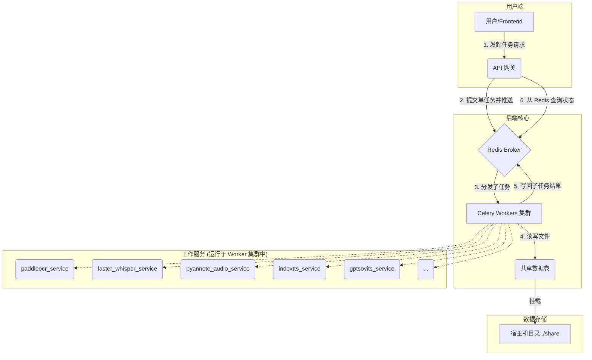

# YiVideo 技术设计文档 (TDD)

## 1. 系统架构

### 1.1. 核心设计原则

系统将基于以下核心原则进行设计，以确保其健壮性、可扩展性和可维护性：

*   **微服务架构 (Microservices)**: 系统功能被拆分为一系列高内聚、低耦合的独立服务，每个服务在独立的 Docker 容器中运行，并拥有独立的依赖。
*   **异步任务驱动 (Asynchronous & Task-Driven)**: 所有耗时操作都将作为异步任务处理。系统采用 **Celery** 作为分布式任务队列框架，**Redis** 作为消息中间件 (Broker) 和结果后端。
*   **单任务调度 (Single Task Dispatch)**: 系统仅提供单节点任务调度，由 **API Gateway** 直接提交任务，不再提供工作流编排服务。
*   **事件驱动数据流 (Event-Driven Data Flow)**: 服务间通过传递共享存储中的文件路径进行协作，避免了直接的文件内容传输。
*   **集中化数据管理 (Centralized Data)**: 所有持久化数据，包括任务文件和 AI 模型，都存储在宿主机的共享目录中，并通过 Docker Volume 挂载到各容器，确保数据的一致性和持久性。

### 1.2. 架构图



### 1.3. 项目目录结构 (解耦后)

为了支持上述微服务架构，项目将采用清晰、模块化的目录结构。

```
.
├── .env
├── .gitignore
├── docker-compose.yml
├── Dockerfile.base
├── README.md
├── data/
│   ├── models/
│   └── workspace/
├── docs/
│   ├── PRD.md
│   └── SDD.md
├── services/             # 所有微服务的源代码根目录
│   ├── api_gateway/      # API 网关服务 (FastAPI)
│   └── workers/          # Celery Worker 服务集群
│       ├── paddleocr_service/      # 新：PaddleOCR 服务
│       ├── faster_whisper_service/ # 新：Faster Whisper ASR 服务
│       ├── pyannote_audio_service/ # 新：Pyannote Audio 说话人分离服务
│       ├── inpainting_service/     # 新：视频修复服务 (STTN/LAMA/PROPAINTER)
│       ├── indextts_service/       # 新：IndexTTS 服务
│       ├── gptsovits_service/      # 新：GPT-SoVITS 服务
│       └── ... (其他 worker, 结构类似)
└── tests/
```

## 2. 组件详解

### 2.1. API 网关 (`api-gateway`)
*   **技术栈**: Python, FastAPI。
*   **职责**: 系统的统一入口，负责认证、路由与请求校验。接收单任务请求并提交 Celery 任务，返回 `task_id`。

### 2.2. 任务队列 (`celery` + `redis`)
*   **Celery**: 负责任务的定义、分发、执行和状态追踪。
*   **Redis**: 担当 Broker 和 Result Backend 的角色。

### 2.3. 共享数据卷
*   **实现**: 通过 `docker-compose.yml` 的 `volumes` 指令实现，所有数据和服务产出物都在宿主机的 `./data` 目录下，便于访问和管理。

### 2.4. 工作服务 (Celery Workers)

每个AI功能被封装成一个独立的、可按需调用的 Celery Worker 服务。

*   **`paddleocr_service` (新)**
    *   **职责**: 提供OCR能力，从视频帧中提取硬字幕。
    *   **核心依赖**: `paddleocr`。

*   **`faster_whisper_service` (新)**
    *   **职责**: 提供高效的ASR能力，从音轨中提取语音字幕。
    *   **核心依赖**: `faster-whisper`。
*   **`pyannote_audio_service` (新)**
    *   **职责**: 提供说话人分离能力。
    *   **核心依赖**: `pyannote.audio`。

*   **`inpainting_service` (新)**
    *   **职责**: 去除视频中的硬字幕，对背景进行修复。
    *   **核心依赖**: `STTN`, `LAMA`, `PROPAINTER` 等视频修复算法。

*   **`indextts_service` (新)**
    *   **职责**: 根据文本和参考音频生成目标语音（TTS）。
    *   **核心依赖**: `indextts`。

*   **`gptsovits_service` (新)**
    *   **职责**: 提供另一种高质量的TTS和声音克隆方案。
    *   **核心依赖**: `GPT-SoVITS`。

*   **`translation_service`**
    *   **职责**: 调用大语言模型API翻译字幕文本。
    *   **核心依赖**: `Gemini` / `DeepSeek` API。

*   **`merger_service`**
    *   **职责**: 将处理好的视频、音频、字幕合并成最终文件。
    *   **核心依赖**: `ffmpeg-python`。

## 3. 核心单任务流程: “视频翻译”节点调用

单任务模式由 API 网关直接调度单个节点，不再提供工作流编排入口。

1.  **API 网关** 接收到请求 `POST /v1/tasks`，请求体包含 `task_name`、`task_id` 与 `input_data`。
2.  网关内部的单任务执行器生成 Celery 任务签名并提交到对应队列。
3.  对应 Worker 执行任务，更新 `WorkflowContext`（单任务模式下 `workflow_id` 与 `task_id` 一致）。
4.  若提供回调地址，API 网关完成后会发送回调；客户端也可通过 `/v1/tasks/{task_id}/status` 或 `/v1/tasks/{task_id}/result` 查询结果。

## 4. 开发与调试

### 4.1. 核心原则: 逻辑分离
*   **业务逻辑**: 必须封装在纯函数或类中，不依赖 Celery 或 FastAPI。例如 `def ocr_video(video_path: str) -> str:`。
*   **服务逻辑**: Celery 的 `@app.task` 或 FastAPI 的 `@app.post` 装饰的函数，负责调用业务逻辑函数。

### 4.2. 调试入口
*   每个服务都必须包含一个 `debug_run.py` 脚本。
*   该脚本可以通过命令行参数接收输入（如文件路径），直接调用核心业务逻辑函数，并打印结果。
*   这允许开发者在不启动整个分布式系统的情况下，对单个功能进行快速测试和调试。
    ```bash
    # 示例
    docker-compose exec subtitle_service python debug_run.py --input /data/workspace/xyz/video.mp4
    ```

## 5. 部署与管理

### 5.1. 部署工具
*   **核心工具**: `Docker Compose`。

### 5.2. Dockerfile 结构
所有服务均基于 `Dockerfile.base` 构建，只在自己的 `Dockerfile` 中添加特定依赖。

**示例: `services/workers/indextts_service/Dockerfile`**
```Dockerfile
# 继承自包含CUDA、Python、FFmpeg等重型依赖的基础镜像
FROM yivideo-base:latest

# 安装该服务特有的系统依赖，例如git
RUN apt-get update && apt-get install -y git && rm -rf /var/lib/apt/lists/*

# 复制源码和依赖定义
WORKDIR /app
COPY ./requirements.txt .

# 安装Python依赖
RUN pip install --no-cache-dir -r requirements.txt

# 克隆并安装 IndexTTS 源码
RUN git clone https://github.com/index-tts/index-tts /opt/indextts
WORKDIR /opt/indextts
RUN pip install -e .

# 下载模型文件
RUN huggingface-cli download IndexTeam/IndexTTS-1.5 --local-dir checkpoints --exclude "*.flac" "*.wav"

# 复制我们自己的Celery task代码
WORKDIR /app
COPY ./app ./app

# 启动命令
CMD ["celery", "-A", "app.celery_app", "worker", "-l", "info", "-Q", "indextts_queue"]
```

### 5.3. `docker-compose.yml` 详解 (示例)

```yaml
version: '3.8'

services:
  redis:
    image: redis:7-alpine
    restart: on-failure

  api_gateway:
    build:
      context: ./services/api_gateway
    # ...

  orchestrator_service:
    build:
      context: ./services/workers/orchestrator_service
    # ...

  # --- AI Worker Services ---

  paddleocr_service:
    build:
      context: ./services/workers/paddleocr_service
    deploy:
      resources:
        reservations:
          devices: [{driver: nvidia, count: 1, capabilities: [gpu]}]
    restart: on-failure

  inpainting_service:
    build:
      context: ./services/workers/inpainting_service
    deploy:
      resources:
        reservations:
          devices: [{driver: nvidia, count: 1, capabilities: [gpu]}]
    restart: on-failure

  faster_whisper_service:
    build:
      context: ./services/workers/faster_whisper_service
  pyannote_audio_service:
    build:
      context: ./services/workers/pyannote_audio_service
    deploy:
      resources:
        reservations:
          devices: [{driver: nvidia, count: 1, capabilities: [gpu]}]
    restart: on-failure

  indextts_service:
    build:
      context: ./services/workers/indextts_service
    deploy:
      resources:
        reservations:
          devices: [{driver: nvidia, count: 1, capabilities: [gpu]}]
    restart: on-failure

  gptsovits_service:
    build:
      context: ./services/workers/gptsovits_service
    deploy:
      resources:
        reservations:
          devices: [{driver: nvidia, count: 1, capabilities: [gpu]}]
    restart: on-failure

  # ... other services

volumes:
  redis_data:
    driver: local
```

## 6. 服务实现细节与优化策略 (v2.0)

本章节补充各服务内部具体的实现技术和性能优化策略。

### 6.1. `subtitle_service` (OCR 模式) 详解

这是系统中最复杂、最耗时的服务之一，其处理流程经过优化以提高准确率和对复杂视频的适应性。

#### a. 核心流程 (v2.0)

服务将遵循一个更加健壮的流程来减少不必要的计算：

1.  **检查手动区域 (Manual Area Check)**: 任务启动时，首先检查 `ocr_params` 中是否包含由用户提供的 `area` 坐标。如果存在，则完全跳过第 2、3步，直接使用该坐标作为唯一的字幕区域进行后续处理。
2.  **场景检测 (Scene Detection)**: **(新增优化)** 如果没有手动区域，则使用 `PySceneDetect` 库对视频进行预处理，将其分割成一系列独立的场景片段。此步骤可以有效防止视频转场（如淡入淡出、镜头切换）干扰后续的像素比对，将关键帧检测的范围限定在稳定的场景内部。
3.  **视频帧采样与字幕区域检测 (Frame Sampling & Area Detection)**: 在**每个场景内部**独立进行帧采样和字幕区域的自动检测。其内部逻辑（聚类、加权）保持不变，但这保证了即使字幕在不同场景下位置发生变化，也能被准确捕捉。
4.  **获取字幕关键帧 (Keyframe Detection)**: 在已确定的“字幕区域”和“场景”内，通过比较相邻帧的像素差异（如SSIM），标记出字幕发生变化的“关键帧”。
5.  **OCR 识别 (OCR Recognition)**: 仅对上一步筛选出的“关键帧”的“字幕区域”进行 `PaddleOCR` 识别。
6.  **参数可配置化**: 将场景检测的阈值、像素比对的敏感度等关键参数作为可选配置项，允许在创建任务时由 `api_gateway` 传入，以便针对特定类型的视频进行效果微调。

#### b. 性能与并发优化

1.  **服务级并发 (Inter-Service Concurrency)**: 
    *   通过 `docker-compose up --scale subtitle_service=N` 可以启动 N 个 `subtitle_service` 容器实例。
    *   Celery 会自动将不同的视频处理任务分发给这些并行的 Worker，实现视频间的并行处理。
2.  **任务级并发 (Intra-Task Concurrency)**: 
    *   对于单个视频任务中需要识别的大量“关键帧”，我们可以在 Celery 任务内部使用 Python 的 `multiprocessing.Pool`。
    *   将多个关键帧的识别工作分配给一个进程池，以充分利用单台服务器的多核 CPU 资源，实现单个视频处理的加速。
3.  **批处理优化 (Batching Optimization)**: 
    *   **多图合并识别**: 这是一个精巧的技巧，用于减少 OCR 模型的调用次数。具体操作是：将多张（如3-5张）待识别的字幕区域图片在内存中纵向拼接成一张大图，然后对这张大图进行单次 `PaddleOCR` 调用。识别完成后，根据返回结果中每个文本框的 `y` 坐标和各子图的高度，可以精确反推出该文本框属于原始的哪一张子图以及其在该子图中的相对坐标。

### 6.2. GPU 资源竞争与解决方案

在单 GPU 服务器上部署多个 GPU 密集型服务时，为解决显存竞争问题，我们引入了基于 Redis 的分布式锁机制，确保在任何时刻只有一个服务能够访问 GPU 资源。

#### a. 设计原则

*   **服务保持独立**: 各 GPU 服务保持为独立的微服务。
*   **资源加锁访问**: 任何需要 GPU 的任务在执行前必须获取全局唯一的“GPU锁”。
*   **保证锁的释放**: 通过心跳和超时机制确保锁最终能被释放，避免死锁。

#### b. 实现方式：`@gpu_lock` 装饰器

我们实现了一个可重用的 `@gpu_lock` 装饰器 (位于 `services/common/locks.py`)，它结合了 Redis Pub/Sub 和轮询，提供了一个高效、事件驱动的锁获取机制。

**1. 锁的核心逻辑**

*   **尝试获取锁**: 任务启动时，尝试在 Redis 中设置一个代表锁的键。
*   **订阅/等待**: 如果获取失败，任务会订阅一个 Redis Pub/Sub 通道，并进入等待状态，而不是消耗 CPU 进行轮询。
*   **锁释放通知**: 当持有锁的任务完成时，它会通过 Pub/Sub 通道发布一条“锁已释放”的消息。
*   **唤醒与重试**: 等待中的任务收到消息后被唤醒，并再次尝试获取锁。
*   **超时与心跳**: 锁本身带有超时时间，并且由一个独立的监控服务 (`GPULockMonitor`) 检查任务心跳，以处理任务崩溃等异常情况，防止死锁。

**2. 在 Celery 任务中应用**

```python
# services/workers/faster_whisper_service/app/tasks.py
from services.common.locks import gpu_lock

@celery_app.task(bind=True, name="faster_whisper.transcribe")
@gpu_lock(timeout=1800, poll_interval=0.5)
def transcribe(self: Task, context: dict) -> dict:
    """
    使用 @gpu_lock 装饰器保护 ASR 任务。
    只有在获取到 GPU 锁之后，任务的实际逻辑才会执行。
    """
    # ... 运行 faster-whisper 的代码 ...
    return context
```

该机制通过事件驱动的方式，避免了大量任务在等待锁时进行无效的 CPU 轮询，显著提高了系统效率和资源利用率。

## 7. 关联项目与核心依赖

本节汇总了项目各模块所依赖或参考的核心开源项目。

| 功能模块 | 服务名称 | 核心依赖/项目 |
| --- | --- | --- |
| 视频下载 | `downloader_service` | `yt-dlp` |
| 字幕提取 (OCR) | `paddleocr_service` | `PaddleOCR` |
| 字幕提取 (ASR) | `faster_whisper_service` | `faster-whisper` |
| 说话人分离 | `pyannote_audio_service` | `pyannote.audio` |
| 硬字幕去除 | `inpainting_service` | `STTN`, `LAMA`, `PROPAINTER` |
| AI配音 (方案一) | `indextts_service` | `IndexTTS` |
| AI配音 (方案二) | `gptsovits_service` | `GPT-SoVITS` |
| 字幕翻译 | `translation_service` | `VideoLingo` (逻辑参考) |
| 视频/音频处理 | *多个服务* | `ffmpeg` |
