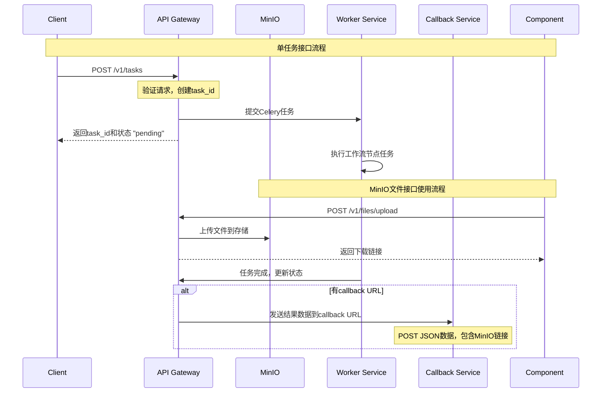

# YiVideo API Gateway 单任务接口与MinIO文件接口设计文档

## 项目概述

为YiVideo系统的API Gateway组件添加两个独立的功能：

1. **单任务接口**：创建区别于`/v1/workflows`的单个功能接口，支持所有工作流节点功能
2. **MinIO文件接口**：为各组件提供独立的文件上传、下载、删除等操作API
3. **Callback功能**：集成到单任务接口中，任务完成后将结果数据通过POST方式返回给callback URL

## 详细设计方案

### 1. 架构设计

#### 1.1 整体架构
```
API Gateway
├── /v1/workflows (现有工作流接口)
├── /v1/tasks (新增单任务接口)
└── /v1/files (新增MinIO文件操作接口)
    ├── POST /v1/files/upload - 上传文件
    ├── GET /v1/files/download/{file_path} - 下载文件
    ├── DELETE /v1/files/{file_path} - 删除文件
    └── GET /v1/files/list/{prefix} - 列出文件
```

#### 1.2 核心模块
- **MinIO文件接口**：独立的MinIO操作API，供各组件使用
- **单任务执行器**：支持单个工作流节点的独立执行
- **Callback管理器**：任务完成后发送结果到callback URL
- **任务状态管理器**：独立的单任务状态追踪

### 2. MinIO文件接口设计

#### 2.1 API模型设计

**FileUploadRequest模型：**
```python
class FileUploadRequest(BaseModel):
    file_path: str  # 文件在MinIO中的路径，如 "task_id/filename.wav"
    bucket: Optional[str] = "yivideo"  # 文件桶，默认yivideo
```

**FileUploadResponse模型：**
```python
class FileUploadResponse(BaseModel):
    file_path: str
    download_url: str  # MinIO下载链接
    size: int
    uploaded_at: str
```

**FileOperationResponse模型：**
```python
class FileOperationResponse(BaseModel):
    success: bool
    message: str
    file_path: Optional[str] = None
    file_size: Optional[int] = None
```

#### 2.2 文件操作接口

**上传文件：**
```http
POST /v1/files/upload
Content-Type: multipart/form-data

file: [文件二进制数据]
file_path: "task_id/filename.wav"
bucket: "yivideo"  # 可选
```

响应：
```json
{
    "file_path": "task_id/filename.wav",
    "download_url": "http://minio:9000/yivideo/task_id/filename.wav",
    "size": 1024000,
    "uploaded_at": "2025-11-16T17:38:00Z"
}
```

**下载文件：**
```http
GET /v1/files/download/{file_path}?bucket=yivideo
```

**删除文件：**
```http
DELETE /v1/files/{file_path}?bucket=yivideo
```

**列出文件：**
```http
GET /v1/files/list/{prefix}?bucket=yivideo
```

#### 2.3 MinIO客户端实现
```python
class MinIOFileService:
    def __init__(self):
        # 从环境变量读取配置
        self.host = os.environ.get('MINIO_HOST')
        self.port = os.environ.get('MINIO_PORT')
        self.access_key = os.environ.get('MINIO_ACCESS_KEY')
        self.secret_key = os.environ.get('MINIO_SECRET_KEY')
        
        self.client = Minio(
            f"{self.host}:{self.port}",
            access_key=self.access_key,
            secret_key=self.secret_key,
            secure=False
        )
        self.default_bucket = "yivideo"
    
    def upload_file(self, file_data: bytes, file_path: str, bucket: str = None) -> Dict:
        """上传文件到MinIO"""
        bucket = bucket or self.default_bucket
        
        # 创建临时文件
        temp_file = tempfile.NamedTemporaryFile(delete=False)
        temp_file.write(file_data)
        temp_file.close()
        
        try:
            # 上传文件
            self.client.fput_object(bucket, file_path, temp_file.name)
            
            # 获取下载链接
            download_url = self.client.presigned_get_object(bucket, file_path)
            
            return {
                "file_path": file_path,
                "download_url": download_url,
                "size": len(file_data),
                "uploaded_at": datetime.utcnow().isoformat() + 'Z'
            }
        finally:
            # 清理临时文件
            os.unlink(temp_file.name)
    
    def download_file(self, file_path: str, bucket: str = None) -> bytes:
        """从MinIO下载文件"""
        bucket = bucket or self.default_bucket
        
        # 创建临时文件
        temp_file = tempfile.NamedTemporaryFile(delete=False)
        temp_file.close()
        
        try:
            # 下载文件
            self.client.fget_object(bucket, file_path, temp_file.name)
            
            # 读取文件数据
            with open(temp_file.name, 'rb') as f:
                return f.read()
        finally:
            # 清理临时文件
            os.unlink(temp_file.name)
    
    def delete_file(self, file_path: str, bucket: str = None) -> bool:
        """删除MinIO中的文件"""
        bucket = bucket or self.default_bucket
        
        try:
            self.client.remove_object(bucket, file_path)
            return True
        except Exception as e:
            logger.error(f"Failed to delete file {file_path}: {e}")
            return False
    
    def list_files(self, prefix: str = "", bucket: str = None) -> List[Dict]:
        """列出MinIO中的文件"""
        bucket = bucket or self.default_bucket
        
        files = []
        try:
            objects = self.client.list_objects(bucket, prefix=prefix)
            for obj in objects:
                files.append({
                    "file_path": obj.object_name,
                    "size": obj.size,
                    "last_modified": obj.last_modified.isoformat() if obj.last_modified else None
                })
        except Exception as e:
            logger.error(f"Failed to list files with prefix {prefix}: {e}")
        
        return files
```

### 3. 单任务接口设计

#### 3.1 API模型设计

**SingleTaskRequest模型：**
```python
class SingleTaskRequest(BaseModel):
    task_name: str  # 工作流节点名称，如 "ffmpeg.extract_audio"
    task_id: str    # 任务唯一标识符
    callback: Optional[str] = None  # 回调URL，任务完成后通知此地址
    input_data: Dict[str, Any]  # 任务输入数据
```

**SingleTaskResponse模型：**
```python
class SingleTaskResponse(BaseModel):
    task_id: str
    status: str  # "pending", "running", "completed", "failed"
    message: str
```

**CallbackResult模型：**
```python
class CallbackResult(BaseModel):
    task_id: str
    status: str  # "completed" 或 "failed"
    result: Dict[str, Any]  # 任务执行结果数据
    minio_files: Optional[List[Dict[str, str]]] = None  # MinIO文件信息列表
    timestamp: str
```

#### 3.2 支持的工作流节点

基于WORKFLOW_NODES_REFERENCE.md，支持以下节点：

**FFmpeg服务节点：**
- `ffmpeg.extract_keyframes` - 抽取关键帧
- `ffmpeg.extract_audio` - 提取音频
- `ffmpeg.crop_subtitle_images` - 裁剪字幕图像
- `ffmpeg.split_audio_segments` - 分割音频片段

**Faster-Whisper服务节点：**
- `faster_whisper.transcribe_audio` - 语音转录

**Audio Separator服务节点：**
- `audio_separator.separate_vocals` - 音频分离

**Pyannote Audio服务节点：**
- `pyannote_audio.diarize_speakers` - 说话人分离

**PaddleOCR服务节点：**
- `paddleocr.detect_subtitle_area` - 检测字幕区域
- `paddleocr.perform_ocr` - 文字识别

**IndexTTS服务节点：**
- `indextts.generate_speech` - 语音合成

**WService服务节点：**
- `wservice.generate_subtitle_files` - 生成字幕文件
- `wservice.correct_subtitles` - 字幕校正
- `wservice.ai_optimize_subtitles` - AI优化字幕

#### 3.3 任务执行流程



### 4. Callback功能设计

#### 4.1 回调机制
- **触发时机**：单任务执行完成后（成功或失败）
- **请求方式**：HTTP POST请求
- **数据格式**：JSON格式
- **重试机制**：网络失败时自动重试

#### 4.2 Callback数据格式
成功时的回调数据：
```json
{
    "task_id": "uuid-string",
    "status": "completed",
    "result": {
        "task_name": "ffmpeg.extract_audio",
        "output": {
            "audio_path": "/share/workflows/task_id/audio.wav"
        },
        "duration": 15.2,
        "metadata": {}
    },
    "minio_files": [
        {
            "name": "audio.wav",
            "url": "http://minio:9000/yivideo/task_id/audio.wav",
            "type": "audio"
        }
    ],
    "timestamp": "2025-11-16T17:38:00Z"
}
```

失败时的回调数据：
```json
{
    "task_id": "uuid-string",
    "status": "failed",
    "result": {
        "error": "输入文件不存在",
        "task_name": "ffmpeg.extract_audio",
        "details": {}
    },
    "timestamp": "2025-11-16T17:38:00Z"
}
```

#### 4.3 错误处理和重试
- **重试策略**：指数退避（1s, 2s, 4s, 8s...）
- **最大重试次数**：3次
- **错误记录**：记录callback失败日志
- **状态同步**：确保callback状态正确反映任务状态

### 5. 技术实现细节

#### 5.1 单任务执行器
```python
class SingleTaskExecutor:
    def __init__(self):
        self.celery_app = create_celery_app()
        self.minio_service = MinIOFileService()
        self.callback_manager = CallbackManager()
    
    def execute_task(self, task_request: SingleTaskRequest):
        # 创建任务上下文
        context = self._create_task_context(task_request)
        
        # 构建Celery任务
        task_signature = self._build_single_task_signature(
            task_request.task_name, 
            context
        )
        
        # 异步执行任务
        result = task_signature.apply_async()
        
        # 创建任务记录
        self._create_task_record(task_request.task_id, result.id)
        
        return task_request.task_id, result.id
    
    def handle_task_completion(self, task_id: str, task_result: Dict):
        """处理任务完成后的逻辑"""
        # 扫描生成的文件并上传到MinIO
        minio_files = self._scan_and_upload_files(task_id, task_result)
        
        # 如果有callback URL，发送结果
        task_record = self._get_task_record(task_id)
        if task_record.get('callback_url'):
            self.callback_manager.send_result(
                task_id, 
                task_result, 
                minio_files,
                task_record['callback_url']
            )
```

#### 5.2 Callback管理器
```python
class CallbackManager:
    def __init__(self):
        self.max_retries = 3
        self.retry_delays = [1, 2, 4]  # 指数退避
    
    def send_result(self, task_id: str, result: Dict, minio_files: List, callback_url: str):
        """发送任务结果到callback URL"""
        callback_data = {
            "task_id": task_id,
            "status": "completed" if result.get('status') == 'SUCCESS' else 'failed',
            "result": result,
            "minio_files": minio_files,
            "timestamp": datetime.utcnow().isoformat() + 'Z'
        }
        
        for attempt in range(self.max_retries):
            try:
                response = requests.post(
                    callback_url,
                    json=callback_data,
                    headers={'Content-Type': 'application/json'},
                    timeout=30
                )
                response.raise_for_status()
                logger.info(f"Callback sent successfully for task {task_id}")
                return True
            except Exception as e:
                logger.warning(f"Callback attempt {attempt + 1} failed for task {task_id}: {e}")
                if attempt < self.max_retries - 1:
                    time.sleep(self.retry_delays[attempt])
        
        logger.error(f"All callback attempts failed for task {task_id}")
        return False
```

### 6. 接口设计

#### 6.1 创建单任务
```http
POST /v1/tasks
Content-Type: application/json

{
    "task_name": "ffmpeg.extract_audio",
    "task_id": "unique-task-id",
    "callback": "https://client.example.com/callback",
    "input_data": {
        "video_path": "/path/to/video.mp4"
    }
}
```

#### 6.2 查询任务状态
```http
GET /v1/tasks/{task_id}/status
```

#### 6.3 MinIO文件操作接口

**上传文件：**
```http
POST /v1/files/upload
Content-Type: multipart/form-data

file: [文件二进制数据]
file_path: "task_id/filename.wav"
bucket: "yivideo"  # 可选
```

**下载文件：**
```http
GET /v1/files/download/task_id/filename.wav?bucket=yivideo
```

**删除文件：**
```http
DELETE /v1/files/task_id/filename.wav?bucket=yivideo
```

**列出文件：**
```http
GET /v1/files/list/task_id?bucket=yivideo
```

### 7. 各组件集成方式

#### 7.1 工作流节点完成后上传文件
各工作流组件在完成处理后，可以：

1. **直接调用MinIO接口上传文件**：
```python
# 在工作流节点中
def upload_result_files(workflow_id: str, files: List[str]):
    for file_path in files:
        with open(file_path, 'rb') as f:
            file_data = f.read()
        
        minio_path = f"{workflow_id}/{os.path.basename(file_path)}"
        response = requests.post(
            "http://api-gateway:8000/v1/files/upload",
            files={'file': file_data},
            data={
                'file_path': minio_path,
                'bucket': 'yivideo'
            }
        )
        
        if response.status_code == 200:
            result = response.json()
            logger.info(f"File uploaded: {result['download_url']}")
```

2. **返回文件路径，让API Gateway处理上传**：
```python
# 在工作流节点中只返回文件路径
return {
    "status": "SUCCESS",
    "output": {
        "generated_files": ["/path/to/output.wav", "/path/to/subtitle.srt"]
    }
}
```

### 8. 错误处理

#### 8.1 错误码定义
- **400**: 请求参数错误
- **404**: 任务/文件不存在
- **409**: 任务ID冲突
- **422**: 任务执行失败
- **500**: 服务器内部错误

#### 8.2 错误响应格式
```json
{
    "error": {
        "code": "FILE_UPLOAD_FAILED",
        "message": "文件上传失败: 无法连接到MinIO服务",
        "timestamp": "2025-11-16T17:38:00Z"
    }
}
```

### 9. 安全性考虑

#### 9.1 访问控制
- **API Key验证**：为接口添加API Key认证
- **文件路径验证**：防止路径遍历攻击
- **文件大小限制**：防止大文件攻击

#### 9.2 资源管理
- **并发限制**：防止系统过载
- **存储空间监控**：避免MinIO空间不足
- **临时文件清理**：及时清理上传过程中的临时文件

### 10. 监控和日志

#### 10.1 监控指标
- **文件操作统计**：上传、下载、删除次数
- **任务执行时间**：平均执行时间统计
- **成功率**：任务成功/失败率
- **Callback成功率**：callback发送成功统计
- **MinIO存储使用情况**：存储空间监控

#### 10.2 日志记录
- **文件操作日志**：详细的文件操作记录
- **任务执行日志**：任务执行过程记录
- **错误日志**：异常情况详细记录
- **Callback日志**：callback发送记录

## 实施计划

### 阶段1：MinIO文件接口
1. 添加MinIO依赖到requirements.txt
2. 创建MinIO文件服务模块
3. 实现文件上传、下载、删除、列出接口

### 阶段2：单任务接口
1. 创建单任务执行器
2. 实现任务状态管理
3. 添加单任务API端点

### 阶段3：Callback集成
1. 实现Callback管理器
2. 集成文件扫描和上传逻辑
3. 添加重试和错误处理

### 阶段4：测试和优化
1. 单元测试和集成测试
2. 各组件集成测试
3. 性能测试和优化

## 预期收益

1. **文件管理标准化**：各组件通过统一接口管理MinIO文件
2. **灵活性提升**：支持单个功能调用，降低使用门槛
3. **异步处理**：callback机制支持事件驱动集成
4. **开发效率**：标准化的接口提高开发效率
5. **运维友好**：完善的监控和日志支持运维管理

---

*文档版本：v1.2*  
*更新时间：2025-11-16*  
*作者：AI Assistant*