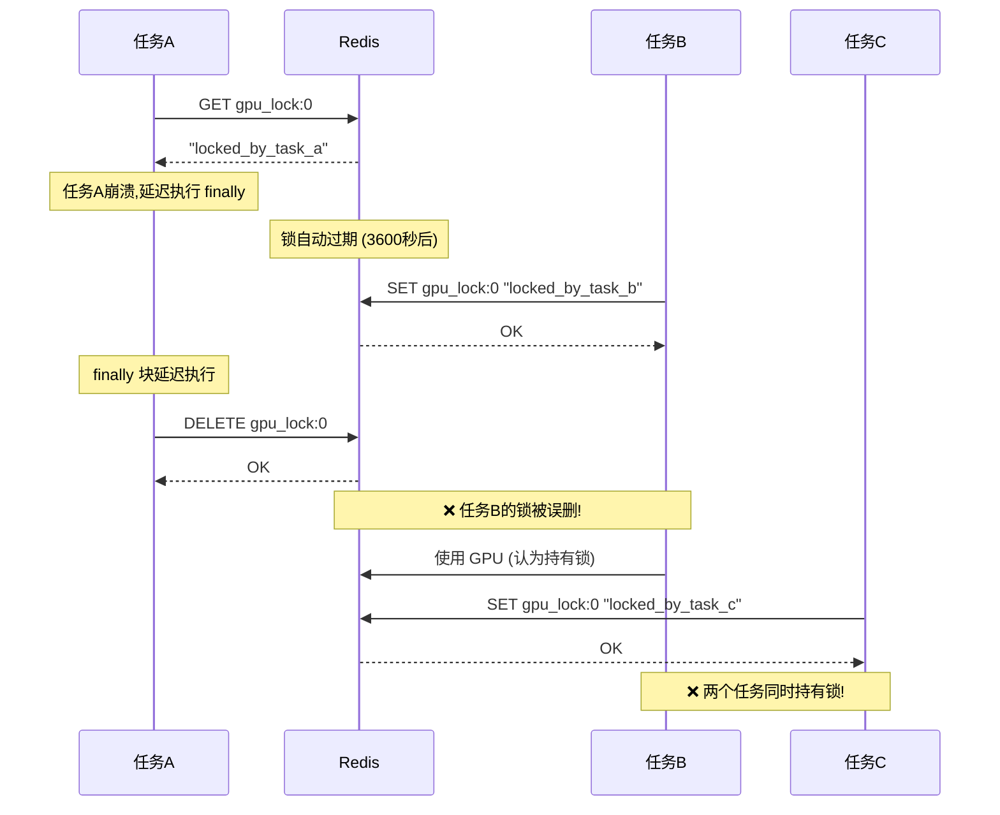
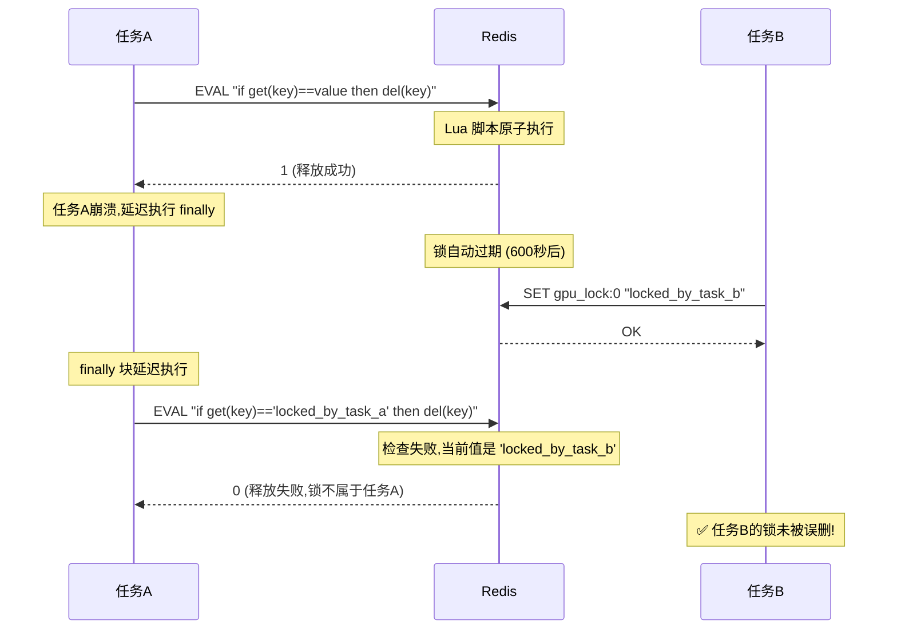
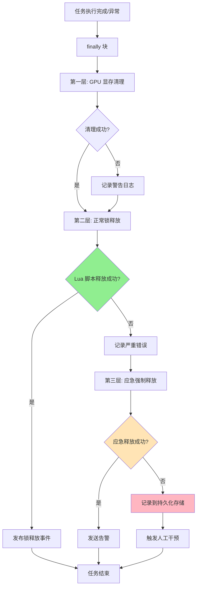

# Design Document: GPU锁死锁风险修复

## 设计目标

消除 GPU 锁系统中的死锁风险和资源泄漏问题,确保在任何异常情况下锁都能被正确释放,提升系统的可靠性和可用性。

## 架构决策

### ADR-001: 使用 Redis Lua 脚本保证原子性

**决策**: 所有涉及"检查-修改"模式的锁操作必须使用 Redis Lua 脚本实现原子性。

**理由**:

#### 技术考量
1. **原子性保证**: Lua 脚本在 Redis 中以原子方式执行,不会被其他命令打断
2. **竞态消除**: 避免 GET + DELETE 之间的时间窗口导致的竞态条件
3. **所有权验证**: 确保只有锁的持有者才能释放锁
4. **性能优势**: 单次网络往返,比多次 Redis 命令更高效

#### 业务考量
1. **数据完整性**: 防止多个任务同时持有锁导致 GPU 资源冲突
2. **系统稳定性**: 避免锁被误删导致的级联故障
3. **可追溯性**: Lua 脚本返回值可用于审计和监控

**实现方式**:
```python
# services/common/locks.py
RELEASE_LOCK_SCRIPT = """
if redis.call("get", KEYS[1]) == ARGV[1] then
    redis.call("del", KEYS[1])
    return 1
else
    return 0
end
"""

def release_lock(self, task_name: str, lock_key: str, release_reason: str = "normal") -> bool:
    lock_value = f"locked_by_{task_name}"
    result = redis_client.eval(RELEASE_LOCK_SCRIPT, 1, lock_key, lock_value)
    return result == 1
```

**替代方案及拒绝理由**:
- ❌ **使用 Redis 事务 (MULTI/EXEC)**: 无法在事务中根据 GET 结果条件性执行 DELETE
- ❌ **使用 WATCH + MULTI**: 复杂且在高并发下性能差
- ❌ **使用分布式锁库 (Redlock)**: 引入新依赖,学习成本高,当前问题不需要多 Redis 实例

### ADR-002: 多层异常保护策略

**决策**: 在锁释放逻辑中实施多层异常保护,确保即使主要释放方式失败,也有应急备份方案。

**理由**:

#### 技术考量
1. **故障隔离**: Redis 连接断开不应导致锁永久泄漏
2. **防御性编程**: 假设任何操作都可能失败
3. **可观测性**: 每层失败都记录日志,便于问题定位

#### 业务考量
1. **系统可用性**: 避免单点故障导致所有 GPU 任务阻塞
2. **恢复时间**: 快速从异常状态恢复
3. **运维友好**: 提供清晰的错误信息和告警

**实现方式**:
```python
# services/common/locks.py (finally 块)
finally:
    # 第一层: GPU 显存清理 (独立于锁释放)
    try:
        force_cleanup_gpu_memory(aggressive=True)
    except Exception as cleanup_e:
        logger.warning(f"GPU显存清理失败: {cleanup_e}")

    # 第二层: 正常锁释放 (使用 Lua 脚本)
    lock_released = False
    try:
        lock_released = lock_manager.release_lock(task_name, lock_key, "normal")
    except Exception as release_error:
        logger.critical(f"正常释放锁失败: {release_error}", exc_info=True)

    # 第三层: 应急强制释放 (直接删除,不验证所有权)
    if not lock_released:
        try:
            logger.warning(f"使用应急方式释放锁 {lock_key}")
            redis_client.delete(lock_key)
            # 发送告警通知运维团队
            send_alert("gpu_lock_emergency_release", {
                "lock_key": lock_key,
                "task_name": task_name
            })
        except Exception as emergency_error:
            logger.critical(f"应急释放锁也失败: {emergency_error}", exc_info=True)
            # 记录到持久化存储,触发人工干预
            record_critical_failure(lock_key, task_name, emergency_error)
```

**风险与缓解**:
- **风险**: 应急释放可能删除其他任务的锁
- **缓解**:
  1. 仅在正常释放失败时触发
  2. 发送告警通知运维
  3. 记录详细日志用于事后分析

### ADR-003: 超时配置优化策略

**决策**: 降低锁超时配置,加快死锁恢复速度,但保留心跳检测机制防止误杀长任务。

**理由**:

#### 当前问题
- `lock_timeout: 3600` 秒 (1小时) - 任务崩溃后锁保留 1 小时
- `hard_timeout: 7200` 秒 (2小时) - 监控系统 2 小时后才强制释放
- **影响**: 死锁恢复时间过长,系统停机时间长

#### 优化方案
```yaml
# config.yml
gpu_lock:
  poll_interval: 2
  max_wait_time: 300        # 5分钟 (从 30分钟降低)
  lock_timeout: 600         # 10分钟 (从 60分钟降低)
  exponential_backoff: true
  max_poll_interval: 10
  use_event_driven: true
  fallback_timeout: 30

gpu_lock_monitor:
  monitor_interval: 30
  timeout_levels:
    warning: 300            # 5分钟警告 (从 30分钟降低)
    soft_timeout: 600       # 10分钟软超时 (从 60分钟降低)
    hard_timeout: 900       # 15分钟强制释放 (从 120分钟降低)
  heartbeat:
    interval: 60            # 任务每 60 秒更新心跳
    timeout: 300            # 5 分钟无心跳判定为死亡
```

#### 长任务保护机制
```python
# services/common/locks.py
@gpu_lock(gpu_id=0, max_wait_time=1800)  # 覆盖默认超时
def long_running_task():
    """超长任务可通过装饰器参数覆盖默认超时"""
    pass
```

**风险矩阵**:

| 场景 | 风险 | 缓解措施 |
|------|------|---------|
| 正常长任务 (1小时) | 被 10分钟超时误杀 | 心跳检测 + 装饰器参数覆盖 |
| 崩溃任务 | 锁保留 10 分钟 | 可接受,比 1小时大幅改善 |
| Redis 断连 | 锁无法释放 | 应急释放机制 + 监控告警 |

### ADR-004: IndexTTS 服务修复策略

**决策**: 修复 IndexTTS 服务中调用不存在方法的错误，确保任务失败时能正确释放锁。

**问题根源**:
```python
# services/workers/indextts_service/app/celery_app.py (第 48 行)
gpu_lock_manager = SmartGpuLockManager()  # ✅ 全局实例正确创建

# services/workers/indextts_service/app/tasks.py (第 38 行)
from .celery_app import celery_app, gpu_lock_manager  # ✅ 导入正确

# services/workers/indextts_service/app/tasks.py (第 49 行)
class IndexTTSTask(Task):
    def __init__(self):
        self.gpu_lock_manager = gpu_lock_manager  # ✅ 变量名正确

# services/workers/indextts_service/app/tasks.py (第 56 行)
def on_failure(self, exc, task_id, args, kwargs, einfo):
    if self.gpu_lock_manager:
        self.gpu_lock_manager.force_release_lock()  # ❌ 方法不存在!
```

**修复方案**:
```python
# services/workers/indextts_service/app/tasks.py
def on_failure(self, exc, task_id, args, kwargs, einfo):
    logger.error(f"任务 {task_id} 失败: {exc}")

    if self.gpu_lock_manager:
        try:
            # 获取 GPU ID 和构造锁键
            gpu_id = kwargs.get('gpu_id', 0)
            lock_key = f"gpu_lock:{gpu_id}"
            # 使用任务 ID 作为任务名
            task_name = task_id
            # ✅ 调用正确的方法
            self.gpu_lock_manager.release_lock(task_name, lock_key, "task_failure")
        except Exception as e:
            logger.error(f"释放锁失败: {e}", exc_info=True)
```

**验证方法**:
```python
# tests/unit/test_indextts_task.py
def test_indextts_task_failure_releases_lock():
    """验证 IndexTTS 任务失败时正确释放锁"""
    task = IndexTTSTask()

    # 模拟任务持有锁
    redis_client.set("gpu_lock:0", "locked_by_test_task", ex=600)

    # 模拟任务失败
    task.on_failure(
        exc=Exception("Test failure"),
        task_id="test_task",
        args=(),
        kwargs={'gpu_id': 0},
        einfo=None
    )

    # 验证锁已释放
    assert not redis_client.exists("gpu_lock:0")
```

## 系统交互分析

### 锁释放流程 (修复前 vs 修复后)

#### 修复前 (存在竞态条件)


#### 修复后 (使用 Lua 脚本)


### 异常处理流程



## 数据结构变更

### Lua 脚本定义

```python
# services/common/locks.py

# 原子释放锁脚本
RELEASE_LOCK_SCRIPT = """
if redis.call("get", KEYS[1]) == ARGV[1] then
    redis.call("del", KEYS[1])
    return 1
else
    return 0
end
"""

# 原子强制释放锁脚本 (监控系统使用)
FORCE_RELEASE_LOCK_SCRIPT = """
local lock_value = redis.call("get", KEYS[1])
if lock_value then
    redis.call("del", KEYS[1])
    return lock_value
else
    return nil
end
"""

# 原子获取锁脚本 (可选优化)
ACQUIRE_LOCK_SCRIPT = """
if redis.call("exists", KEYS[1]) == 0 then
    redis.call("set", KEYS[1], ARGV[1], "EX", ARGV[2])
    return 1
else
    return 0
end
"""
```

### 配置结构调整

```yaml
# config.yml (修改后)
gpu_lock:
  # 基础配置
  poll_interval: 2
  max_wait_time: 300        # ✅ 从 1800 降低到 300
  lock_timeout: 600         # ✅ 从 3600 降低到 600
  exponential_backoff: true
  max_poll_interval: 10
  use_event_driven: true
  fallback_timeout: 30

  # 新增: 异常处理配置
  exception_handling:
    enable_emergency_release: true      # 启用应急释放
    emergency_release_delay: 5          # 应急释放前等待时间(秒)
    max_release_retries: 3              # 最大重试次数

  # 新增: 心跳配置
  heartbeat:
    enabled: true
    interval: 60                        # 心跳间隔(秒)
    timeout: 300                        # 心跳超时(秒)

gpu_lock_monitor:
  monitor_interval: 30
  timeout_levels:
    warning: 300              # ✅ 从 1800 降低到 300
    soft_timeout: 600         # ✅ 从 3600 降低到 600
    hard_timeout: 900         # ✅ 从 7200 降低到 900
  heartbeat:
    interval: 60
    timeout: 300
  cleanup:
    max_retry: 3
    retry_delay: 60
  enabled: true
  auto_recovery: true
```

## 可观测性增强

### 新增监控指标

```python
# services/common/locks.py

class SmartGpuLockManager:
    def __init__(self):
        # ... 现有代码 ...

        # 新增: 异常统计
        self.exception_stats = {
            "normal_release_failures": 0,      # 正常释放失败次数
            "emergency_releases": 0,           # 应急释放次数
            "release_script_errors": 0,        # Lua 脚本错误次数
            "ownership_violations": 0,         # 所有权验证失败次数
        }

    def get_exception_statistics(self) -> Dict[str, Any]:
        """获取异常统计信息"""
        return {
            **self.exception_stats,
            "exception_rate": self.exception_stats["normal_release_failures"] / max(self.lock_stats["total_locks"], 1),
            "emergency_release_rate": self.exception_stats["emergency_releases"] / max(self.lock_stats["total_locks"], 1),
        }
```

### 新增健康检查 API

```python
# services/api_gateway/app/routes/monitoring.py

@router.get("/gpu-lock/health")
async def gpu_lock_health_check():
    """GPU 锁系统健康检查"""
    health = lock_manager.health_check()

    return {
        "status": health["status"],
        "redis_connected": health["redis_connected"],
        "zombie_locks": health.get("zombie_locks", []),
        "long_held_locks": health.get("long_held_locks", []),
        "exception_stats": lock_manager.get_exception_statistics(),
        "timestamp": time.time()
    }
```

### 告警规则

```python
# services/api_gateway/app/monitoring/gpu_lock_monitor.py

def _check_and_alert(self):
    """检查并发送告警"""
    stats = lock_manager.get_statistics()
    exception_stats = lock_manager.get_exception_statistics()

    alerts = []

    # 1. 应急释放率过高
    if exception_stats["emergency_release_rate"] > 0.05:
        alerts.append({
            "level": "critical",
            "type": "high_emergency_release_rate",
            "message": f"应急释放率过高: {exception_stats['emergency_release_rate']:.2%}",
            "value": exception_stats["emergency_release_rate"]
        })

    # 2. 所有权验证失败
    if exception_stats["ownership_violations"] > 0:
        alerts.append({
            "level": "warning",
            "type": "ownership_violations",
            "message": f"检测到 {exception_stats['ownership_violations']} 次所有权验证失败",
            "value": exception_stats["ownership_violations"]
        })

    # 3. Lua 脚本错误
    if exception_stats["release_script_errors"] > 0:
        alerts.append({
            "level": "critical",
            "type": "lua_script_errors",
            "message": f"Lua 脚本执行错误: {exception_stats['release_script_errors']} 次",
            "value": exception_stats["release_script_errors"]
        })

    # 发送告警
    for alert in alerts:
        self._send_alert(alert)
```

## 测试策略

### Phase 1 (P0) - 单元测试

```python
# tests/unit/test_gpu_lock_atomicity.py

def test_release_lock_atomicity():
    """验证锁释放的原子性"""
    lock_key = "gpu_lock:0"
    task_name = "test_task"

    # 1. 获取锁
    lock_manager.acquire_lock(task_name, lock_key)

    # 2. 模拟并发释放
    def release_by_wrong_task():
        lock_manager.release_lock("wrong_task", lock_key, "malicious")

    thread = threading.Thread(target=release_by_wrong_task)
    thread.start()
    thread.join()

    # 3. 验证锁未被误删
    assert redis_client.exists(lock_key)
    assert redis_client.get(lock_key) == f"locked_by_{task_name}"

def test_emergency_release_on_redis_failure():
    """验证 Redis 故障时的应急释放"""
    with patch('services.common.locks.redis_client') as mock_redis:
        # 模拟 Redis 连接断开
        mock_redis.eval.side_effect = redis.ConnectionError("Connection lost")
        mock_redis.delete.return_value = True

        # 执行释放
        result = lock_manager.release_lock("test_task", "gpu_lock:0", "normal")

        # 验证应急释放被调用
        mock_redis.delete.assert_called_once_with("gpu_lock:0")
```

### Phase 1 (P0) - 集成测试

```python
# tests/integration/test_gpu_lock_deadlock.py

@pytest.mark.integration
def test_no_deadlock_on_task_crash():
    """验证任务崩溃不会导致永久死锁"""
    lock_key = "gpu_lock:0"

    # 1. 启动任务并模拟崩溃
    @gpu_lock(gpu_id=0)
    def crashing_task():
        raise Exception("Simulated crash")

    with pytest.raises(Exception):
        crashing_task()

    # 2. 验证锁已释放
    time.sleep(1)  # 等待 finally 块执行
    assert not redis_client.exists(lock_key)

@pytest.mark.integration
def test_concurrent_lock_acquisition():
    """验证并发获取锁的正确性"""
    results = []

    def acquire_and_hold(task_id):
        try:
            @gpu_lock(gpu_id=0, max_wait_time=5)
            def task():
                results.append(task_id)
                time.sleep(2)
            task()
        except Exception as e:
            logger.error(f"任务 {task_id} 失败: {e}")

    # 启动 10 个并发任务
    threads = [threading.Thread(target=acquire_and_hold, args=(i,)) for i in range(10)]
    for t in threads:
        t.start()
    for t in threads:
        t.join()

    # 验证: 所有任务都成功执行,且无并发冲突
    assert len(results) <= 10  # 部分任务可能超时
    assert len(set(results)) == len(results)  # 无重复执行
```

### Phase 2 (P1) - 性能测试

```python
# tests/performance/test_gpu_lock_performance.py

@pytest.mark.performance
def test_lock_release_performance():
    """验证 Lua 脚本不会显著降低性能"""
    lock_key = "gpu_lock:0"
    iterations = 1000

    # 测试 Lua 脚本释放性能
    start = time.time()
    for i in range(iterations):
        task_name = f"task_{i}"
        redis_client.set(lock_key, f"locked_by_{task_name}", ex=60)
        lock_manager.release_lock(task_name, lock_key, "normal")
    lua_duration = time.time() - start

    # 基准: 直接 DELETE 性能
    start = time.time()
    for i in range(iterations):
        redis_client.set(lock_key, f"locked_by_task_{i}", ex=60)
        redis_client.delete(lock_key)
    direct_duration = time.time() - start

    # 验证: Lua 脚本性能损失 < 20%
    assert lua_duration < direct_duration * 1.2
```

## 向后兼容性

### Phase 1 (P0) - 代码修复
- ✅ **完全兼容**: 修复 bug 不改变 API 接口
- ✅ **行为改进**: 锁释放更安全,但对外部调用者透明

### Phase 2 (P1) - 配置变更
- ⚠️ **行为变更**: 超时时间缩短,可能影响长任务
- **缓解措施**:
  1. 通过装饰器参数覆盖超时配置
  2. 心跳检测防止误杀
  3. 灰度发布验证影响

## 部署注意事项

### Phase 1 部署 (P0)

**准备工作**:
1. 备份当前代码
2. 准备回滚脚本
3. 通知运维团队

**部署步骤**:
```bash
# 1. 更新代码
git pull origin fix/gpu-lock-deadlock-risks

# 2. 重启受影响的服务
docker-compose restart api_gateway
docker-compose restart indextts_service
docker-compose restart paddleocr_service
docker-compose restart faster_whisper_service
docker-compose restart ffmpeg_service

# 3. 监控关键指标
watch -n 5 'curl http://localhost:8788/api/v1/monitoring/gpu-lock/health | jq'
```

**验证步骤**:
```bash
# 1. 检查服务健康
curl http://localhost:8788/api/v1/monitoring/gpu-lock/health

# 2. 触发测试任务
curl -X POST http://localhost:8788/api/v1/tasks/paddleocr/test

# 3. 检查日志
docker-compose logs -f --tail=100 paddleocr_service | grep "release_lock"
```

### Phase 2 部署 (P1)

**金丝雀部署**:
```bash
# 1. 在 10% 节点上应用新配置
# 修改 config.yml (仅金丝雀节点)
vim config.yml

# 2. 重启金丝雀节点
docker-compose restart api_gateway

# 3. 观察 24 小时
# 监控指标: 任务成功率, 锁超时率, Redis CPU
```

**回滚步骤**:
```bash
# 恢复配置
cp config.yml.backup config.yml

# 重启服务
docker-compose restart api_gateway paddleocr_service faster_whisper_service
```

## 成功指标

### Phase 1 (P0) 成功标准
- [ ] 所有单元测试通过 (覆盖率 > 90%)
- [ ] 集成测试通过 (无死锁,无锁泄漏)
- [ ] 生产环境运行 7 天无锁相关事故
- [ ] 应急释放率 < 1%

### Phase 2 (P1) 成功标准
- [ ] 死锁恢复时间 < 15 分钟 (从 1-2 小时降低)
- [ ] 长任务不被误杀 (心跳检测有效)
- [ ] 监控告警正常触发
- [ ] 灰度发布 7 天无回滚

---

**设计作者**: Claude AI
**创建日期**: 2025-12-24
**审查状态**: Pending Review
**关联提案**: `fix-gpu-lock-deadlock-risks`
