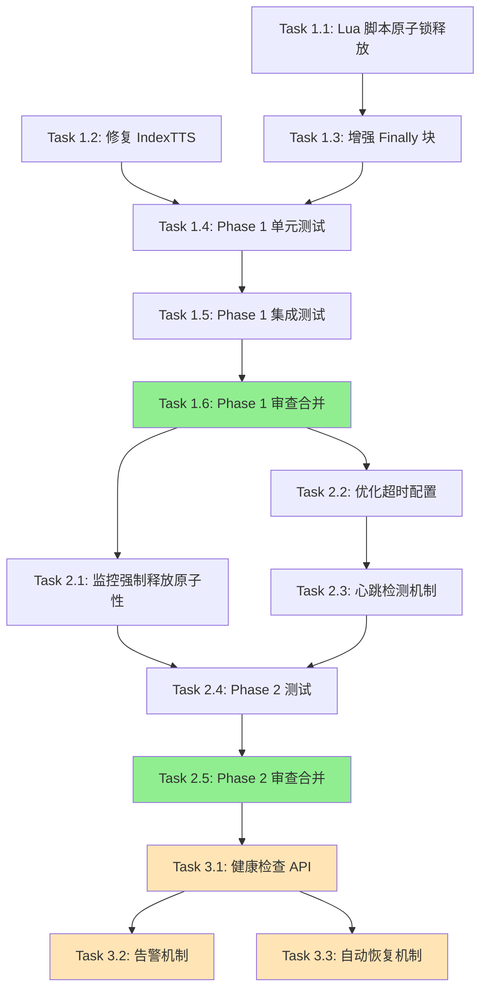

# Tasks: GPU锁死锁风险修复

## 任务概述

本任务清单将 `fix-gpu-lock-deadlock-risks` 提案分解为可执行的小型工作项,按依赖顺序排列。

---

## Phase 1: Critical 问题修复 (P0 - 必须立即执行)

### Task 1.1: 实现 Lua 脚本原子锁释放
**优先级**: P0 (Critical)
**预计时间**: 2 小时
**依赖**: 无

**描述**:
使用 Redis Lua 脚本重写 `release_lock` 方法,保证锁释放的原子性和所有权验证。

**执行步骤**:
1. 在 `services/common/locks.py` 中定义 Lua 脚本常量:
   ```python
   RELEASE_LOCK_SCRIPT = """
   if redis.call("get", KEYS[1]) == ARGV[1] then
       redis.call("del", KEYS[1])
       return 1
   else
       return 0
   end
   """
   ```

2. 重写 `release_lock` 方法:
   ```python
   def release_lock(self, task_name: str, lock_key: str, release_reason: str = "normal") -> bool:
       if not redis_client:
           return False

       try:
           lock_value = f"locked_by_{task_name}"
           result = redis_client.eval(RELEASE_LOCK_SCRIPT, 1, lock_key, lock_value)

           if result == 1:
               logger.info(f"任务 {task_name} 释放锁 '{lock_key}' (原因: {release_reason})")
               pub_sub_manager.publish_lock_release(lock_key, task_name, release_reason)
               return True
           else:
               current_value = redis_client.get(lock_key)
               logger.warning(f"任务 {task_name} 尝试释放不持有的锁 (当前值: {current_value})")
               self.exception_stats["ownership_violations"] += 1
               return False

       except redis.exceptions.ResponseError as e:
           logger.error(f"Lua 脚本执行失败: {e}", exc_info=True)
           self.exception_stats["release_script_errors"] += 1
           return False
       except Exception as e:
           logger.error(f"释放锁异常: {e}", exc_info=True)
           return False
   ```

3. 添加异常统计字段到 `__init__`:
   ```python
   self.exception_stats = {
       "normal_release_failures": 0,
       "emergency_releases": 0,
       "release_script_errors": 0,
       "ownership_violations": 0,
   }
   ```

**验证标准**:
- [ ] Lua 脚本正确验证锁所有权
- [ ] 并发释放不会导致误删
- [ ] 异常统计正确记录
- [ ] 单元测试通过 (test_release_lock_atomicity.py)

**产出物**:
- 更新后的 `services/common/locks.py` (release_lock 方法)

---

### Task 1.2: 修复 IndexTTS 服务方法调用错误
**优先级**: P0 (Critical)
**预计时间**: 30 分钟
**依赖**: 无

**描述**:
修复 IndexTTS 服务 `on_failure` 回调中调用不存在方法的错误。

**执行步骤**:
1. 定位 `services/workers/indextts_service/app/tasks.py` 第 51-56 行

2. 修改 `on_failure` 方法:
   ```python
   # 修改前
   def on_failure(self, exc, task_id, args, kwargs, einfo):
       """任务失败时的回调"""
       logger.error(f"任务 {task_id} 失败: {exc}")
       # 清理GPU锁
       if self.gpu_lock_manager:
           self.gpu_lock_manager.force_release_lock()  # ❌ 方法不存在

   # 修改后
   def on_failure(self, exc, task_id, args, kwargs, einfo):
       """任务失败时的回调"""
       logger.error(f"任务 {task_id} 失败: {exc}")

       # ✅ 使用正确的方法释放锁
       if self.gpu_lock_manager:
           try:
               # 获取 GPU ID 和构造锁键
               gpu_id = kwargs.get('gpu_id', 0)
               lock_key = f"gpu_lock:{gpu_id}"
               # 使用任务 ID 作为任务名
               task_name = task_id
               # 调用正确的方法
               self.gpu_lock_manager.release_lock(task_name, lock_key, "task_failure")
               logger.info(f"任务 {task_id} 失败后成功释放锁 {lock_key}")
           except Exception as e:
               logger.error(f"释放锁失败: {e}", exc_info=True)
   ```

**验证标准**:
- [ ] 代码无 AttributeError
- [ ] 任务失败时 `on_failure` 正常执行
- [ ] 锁被正确释放
- [ ] 单元测试通过 (test_indextts_error_handling.py)

**产出物**:
- 更新后的 `services/workers/indextts_service/app/tasks.py`

---

### Task 1.3: 增强 Finally 块异常处理
**优先级**: P0 (Critical)
**预计时间**: 2 小时
**依赖**: Task 1.1

**描述**:
实现多层异常保护,确保锁一定被释放,即使发生异常。

**执行步骤**:
1. 定位 `services/common/locks.py` 中的 `@gpu_lock` 装饰器 finally 块 (第 726-740 行)

2. 重写 finally 块:
   ```python
   finally:
       # 第一层: GPU 显存清理
       try:
           force_cleanup_gpu_memory(aggressive=True)
       except Exception as cleanup_e:
           logger.warning(f"GPU显存清理失败: {cleanup_e}")

       # 第二层: 正常锁释放
       lock_released = False
       try:
           lock_released = lock_manager.release_lock(task_name, lock_key, "normal")
       except Exception as release_error:
           logger.critical(f"正常释放锁失败: {release_error}", exc_info=True)
           lock_manager.exception_stats["normal_release_failures"] += 1

       # 第三层: 应急强制释放
       if not lock_released:
           try:
               logger.warning(f"使用应急方式释放锁 {lock_key}")
               redis_client.delete(lock_key)
               lock_manager.exception_stats["emergency_releases"] += 1

               # 发送告警
               send_alert("gpu_lock_emergency_release", {
                   "lock_key": lock_key,
                   "task_name": task_name,
                   "timestamp": time.time()
               })
           except Exception as emergency_error:
               logger.critical(f"应急释放锁也失败: {emergency_error}", exc_info=True)
               record_critical_failure(lock_key, task_name, emergency_error)
   ```

3. 实现 `record_critical_failure` 函数:
   ```python
   def record_critical_failure(lock_key: str, task_name: str, error: Exception):
       """记录关键失败到持久化存储"""
       failure_record = {
           "lock_key": lock_key,
           "task_name": task_name,
           "error": str(error),
           "traceback": traceback.format_exc(),
           "timestamp": time.time(),
           "hostname": socket.gethostname()
       }

       log_file = "/var/log/yivideo/gpu_lock_critical_failures.log"
       try:
           os.makedirs(os.path.dirname(log_file), exist_ok=True)
           with open(log_file, "a") as f:
               f.write(json.dumps(failure_record) + "\n")
       except Exception as e:
           logger.critical(f"无法写入关键失败日志: {e}")

       send_alert("gpu_lock_critical_failure", {
           "level": "P0",
           "message": f"GPU 锁关键失败: {lock_key}",
           "details": failure_record
       })
   ```

4. 实现 `send_alert` 函数 (简单版本):
   ```python
   def send_alert(alert_type: str, data: Dict[str, Any]):
       """发送告警 (当前仅记录日志,后续可扩展)"""
       logger.error(f"[告警] {alert_type}: {data}")
       # TODO: 集成邮件、Slack、钉钉等通知渠道
   ```

**验证标准**:
- [ ] Redis 连接断开时仍能尝试释放锁
- [ ] 应急释放被正确触发
- [ ] 关键失败被记录到日志文件
- [ ] 单元测试通过 (test_finally_block_exception_isolation.py)

**产出物**:
- 更新后的 `services/common/locks.py` (finally 块)
- 新增 `record_critical_failure` 和 `send_alert` 函数

---

### Task 1.4: 编写 Phase 1 单元测试
**优先级**: P0 (Critical)
**预计时间**: 3 小时
**依赖**: Task 1.1, 1.2, 1.3

**描述**:
为 Phase 1 的所有修复编写全面的单元测试。

**执行步骤**:
1. 创建 `tests/unit/test_gpu_lock_atomicity.py`:
   ```python
   def test_release_lock_ownership_verification()
   def test_concurrent_release_no_race_condition()
   def test_lua_script_error_handling()
   ```

2. 创建 `tests/unit/test_indextts_error_handling.py`:
   ```python
   def test_indextts_on_failure_releases_lock()
   def test_indextts_no_name_error()
   ```

3. 创建 `tests/unit/test_gpu_lock_error_handling.py`:
   ```python
   def test_finally_block_exception_isolation()
   def test_emergency_release_on_normal_failure()
   def test_critical_failure_recording()
   ```

**验证标准**:
- [ ] 所有测试通过
- [ ] 代码覆盖率 > 90%
- [ ] 测试覆盖所有异常路径

**产出物**:
- `tests/unit/test_gpu_lock_atomicity.py`
- `tests/unit/test_indextts_error_handling.py`
- `tests/unit/test_gpu_lock_error_handling.py`

---

### Task 1.5: 编写 Phase 1 集成测试
**优先级**: P0 (Critical)
**预计时间**: 2 小时
**依赖**: Task 1.4

**描述**:
编写集成测试,验证 Phase 1 修复在真实环境中的表现。

**执行步骤**:
1. 创建 `tests/integration/test_gpu_lock_deadlock.py`:
   ```python
   @pytest.mark.integration
   def test_no_deadlock_on_task_crash()

   @pytest.mark.integration
   def test_concurrent_lock_acquisition()

   @pytest.mark.integration
   def test_indextts_task_failure_integration()
   ```

2. 创建测试夹具:
   ```python
   @pytest.fixture
   def redis_cleanup():
       """清理 Redis 测试数据"""
       yield
       for key in redis_client.scan_iter("gpu_lock:*"):
           redis_client.delete(key)
   ```

**验证标准**:
- [ ] 所有集成测试通过
- [ ] 测试覆盖真实的 Redis 交互
- [ ] 测试覆盖真实的 Celery 任务执行

**产出物**:
- `tests/integration/test_gpu_lock_deadlock.py`

---

### Task 1.6: Phase 1 代码审查与合并
**优先级**: P0 (Critical)
**预计时间**: 2 小时
**依赖**: Task 1.1, 1.2, 1.3, 1.4, 1.5

**描述**:
提交 PR,进行代码审查,合并到主分支。

**执行步骤**:
1. 创建 Git 分支: `fix/gpu-lock-deadlock-phase1`
2. 提交所有代码变更:
   ```bash
   git add services/common/locks.py
   git add services/workers/indextts_service/app/tasks.py
   git add tests/unit/test_gpu_lock_*.py
   git add tests/integration/test_gpu_lock_deadlock.py

   git commit -m "fix(gpu-lock): 修复死锁风险 - Phase 1

   - 使用 Lua 脚本保证锁释放原子性
   - 修复 IndexTTS 服务未定义变量错误
   - 增强 finally 块异常处理
   - 添加应急释放和关键失败记录机制

   🤖 Generated with [Claude Code](https://claude.com/claude-code)

   Co-Authored-By: Claude <noreply@anthropic.com>"
   ```

3. 运行所有测试:
   ```bash
   pytest tests/unit/test_gpu_lock_*.py -v
   pytest tests/integration/test_gpu_lock_deadlock.py -v
   ```

4. 创建 PR,附上详细说明
5. 至少 2 名团队成员审查
6. 合并到 `master` 分支

**验证标准**:
- [ ] 所有测试通过
- [ ] 至少 2 名审查者批准
- [ ] 无合并冲突
- [ ] CI/CD 流程通过

**产出物**:
- Git PR 和合并记录

---

## Phase 2: High 问题修复 (P1 - 1周内)

### Task 2.1: 实现监控强制释放原子性
**优先级**: P1 (High)
**预计时间**: 1.5 小时
**依赖**: Phase 1 完成

**描述**:
使用 Lua 脚本重写监控系统的 `_force_release_lock` 方法。

**执行步骤**:
1. 定位 `services/api_gateway/app/monitoring/gpu_lock_monitor.py` 第 247-273 行

2. 定义 Lua 脚本:
   ```python
   FORCE_RELEASE_LOCK_SCRIPT = """
   local lock_value = redis.call("get", KEYS[1])
   if lock_value then
       redis.call("del", KEYS[1])
       return lock_value
   else
       return nil
   end
   """
   ```

3. 重写 `_force_release_lock` 方法:
   ```python
   def _force_release_lock(self, lock_key: str) -> bool:
       try:
           released_value = self.redis_client.eval(FORCE_RELEASE_LOCK_SCRIPT, 1, lock_key)

           if released_value:
               logger.info(f"强制释放锁 {lock_key} (持有者: {released_value})")
               from services.common.locks import pub_sub_manager
               pub_sub_manager.publish_lock_release(lock_key, released_value, "forced_by_monitor")
               return True
           else:
               logger.info(f"锁 {lock_key} 已不存在")
               return True

       except Exception as e:
           logger.error(f"强制释放锁异常: {e}")
           return False
   ```

**验证标准**:
- [ ] 监控不会误删正常任务的锁
- [ ] 单元测试通过

**产出物**:
- 更新后的 `gpu_lock_monitor.py`

---

### Task 2.2: 优化超时配置
**优先级**: P1 (High)
**预计时间**: 1 小时
**依赖**: Phase 1 完成

**描述**:
更新 `config.yml` 中的超时配置,加快死锁恢复速度。

**执行步骤**:
1. 备份当前配置:
   ```bash
   cp config.yml config.yml.backup
   ```

2. 更新 `config.yml`:
   ```yaml
   gpu_lock:
     poll_interval: 2
     max_wait_time: 300        # ✅ 从 1800 降低到 300
     lock_timeout: 600         # ✅ 从 3600 降低到 600
     exponential_backoff: true
     max_poll_interval: 10
     use_event_driven: true
     fallback_timeout: 30

     # 新增: 心跳配置
     heartbeat:
       enabled: true
       interval: 60
       timeout: 300

   gpu_lock_monitor:
     monitor_interval: 30
     timeout_levels:
       warning: 300            # ✅ 从 1800 降低到 300
       soft_timeout: 600       # ✅ 从 3600 降低到 600
       hard_timeout: 900       # ✅ 从 7200 降低到 900
     heartbeat:
       interval: 60
       timeout: 300
     cleanup:
       max_retry: 3
       retry_delay: 60
     enabled: true
     auto_recovery: true
   ```

3. 添加配置注释:
   ```yaml
   gpu_lock:
     poll_interval: 2  # 轮询间隔(秒)
     max_wait_time: 300  # 最大等待时间(秒) - 5分钟
     # 注意: 长时间运行任务应通过装饰器参数覆盖此配置
     lock_timeout: 600  # 锁超时时间(秒) - 10分钟
   ```

**验证标准**:
- [ ] 配置文件语法正确
- [ ] 注释清晰准确
- [ ] 备份文件已创建

**产出物**:
- 更新后的 `config.yml`
- `config.yml.backup`

---

### Task 2.3: 实现心跳检测机制
**优先级**: P1 (High)
**预计时间**: 3 小时
**依赖**: Task 2.2

**描述**:
在锁管理器和监控系统中实现心跳检测机制。

**执行步骤**:
1. 在 `services/common/locks.py` 中实现心跳更新:
   ```python
   def _update_heartbeat(self, lock_key: str):
       """定期更新心跳"""
       heartbeat_key = f"{lock_key}:heartbeat"
       interval = self.config.get("heartbeat", {}).get("interval", 60)

       while True:
           try:
               if not redis_client.exists(lock_key):
                   break

               redis_client.set(heartbeat_key, str(time.time()), ex=interval * 2)
               time.sleep(interval)
           except Exception as e:
               logger.error(f"更新心跳失败: {e}")
               break
   ```

2. 在 `acquire_lock_with_smart_polling` 中启动心跳线程:
   ```python
   @contextmanager
   def acquire_lock_with_smart_polling(...):
       # ... 获取锁 ...

       try:
           # 启动心跳更新线程
           if self.config.get("heartbeat", {}).get("enabled", False):
               heartbeat_thread = threading.Thread(
                   target=self._update_heartbeat,
                   args=(lock_key,),
                   daemon=True
               )
               heartbeat_thread.start()

           yield
       finally:
           # ... 释放锁 ...
   ```

3. 在 `gpu_lock_monitor.py` 中实现心跳检查:
   ```python
   def _check_heartbeat(self, lock_key: str) -> bool:
       """检查任务心跳状态"""
       heartbeat_key = f"{lock_key}:heartbeat"
       last_heartbeat = self.redis_client.get(heartbeat_key)

       if not last_heartbeat:
           logger.warning(f"锁 {lock_key} 无心跳记录")
           return False

       try:
           last_heartbeat_time = float(last_heartbeat)
           time_since_heartbeat = time.time() - last_heartbeat_time

           heartbeat_timeout = self.config.get("heartbeat", {}).get("timeout", 300)

           if time_since_heartbeat < heartbeat_timeout:
               logger.info(f"锁 {lock_key} 心跳正常 (最后心跳: {time_since_heartbeat:.1f}秒前)")
               return True
           else:
               logger.warning(f"锁 {lock_key} 心跳超时 ({time_since_heartbeat:.1f}秒)")
               return False
       except Exception as e:
           logger.error(f"检查心跳失败: {e}")
           return False
   ```

**验证标准**:
- [ ] 心跳正常更新
- [ ] 监控正确检测心跳状态
- [ ] 长任务不被误杀

**产出物**:
- 更新后的 `locks.py` 和 `gpu_lock_monitor.py`

---

### Task 2.4: 编写 Phase 2 测试
**优先级**: P1 (High)
**预计时间**: 2 小时
**依赖**: Task 2.1, 2.2, 2.3

**描述**:
为 Phase 2 的修复编写测试。

**执行步骤**:
1. 创建 `tests/unit/test_gpu_lock_monitoring.py`:
   ```python
   def test_monitor_force_release_atomicity()
   def test_heartbeat_detection()
   ```

2. 创建 `tests/performance/test_gpu_lock_timeout.py`:
   ```python
   @pytest.mark.performance
   def test_lock_timeout_recovery_time()

   @pytest.mark.performance
   def test_long_task_not_killed()
   ```

**验证标准**:
- [ ] 所有测试通过
- [ ] 性能测试验证恢复时间 < 15 分钟

**产出物**:
- `tests/unit/test_gpu_lock_monitoring.py`
- `tests/performance/test_gpu_lock_timeout.py`

---

### Task 2.5: Phase 2 代码审查与合并
**优先级**: P1 (High)
**预计时间**: 2 小时
**依赖**: Task 2.1, 2.2, 2.3, 2.4

**描述**:
提交 PR,进行代码审查,合并到主分支。

**执行步骤**:
1. 创建 Git 分支: `fix/gpu-lock-deadlock-phase2`
2. 提交所有代码变更
3. 运行所有测试
4. 创建 PR
5. 至少 2 名团队成员审查
6. 合并到 `master` 分支

**验证标准**:
- [ ] 所有测试通过
- [ ] 至少 2 名审查者批准
- [ ] 无合并冲突

**产出物**:
- Git PR 和合并记录

---

## Phase 3: 增强功能 (P2 - 1个月内,可选)

### Task 3.1: 实现健康检查 API
**优先级**: P2 (Medium)
**预计时间**: 2 小时
**依赖**: Phase 2 完成

**描述**:
实现 GPU 锁系统健康检查 API。

**执行步骤**:
1. 在 `services/common/locks.py` 中实现 `health_check` 方法
2. 在 `services/api_gateway/app/routes/monitoring.py` 中添加 API 端点:
   ```python
   @router.get("/gpu-lock/health")
   async def gpu_lock_health_check():
       return lock_manager.health_check()
   ```

**验证标准**:
- [ ] API 正常返回健康状态
- [ ] 能检测僵尸锁和长时间持有锁

**产出物**:
- 更新后的 `locks.py` 和 `monitoring.py`

---

### Task 3.2: 实现告警机制
**优先级**: P2 (Medium)
**预计时间**: 3 小时
**依赖**: Task 3.1

**描述**:
实现监控告警机制,及时发现锁异常。

**执行步骤**:
1. 在 `gpu_lock_monitor.py` 中实现 `_check_and_alert` 方法
2. 实现 `_send_alert` 方法 (支持多种通知渠道)
3. 在监控循环中调用告警检查

**验证标准**:
- [ ] 告警正确触发
- [ ] 告警包含详细信息

**产出物**:
- 更新后的 `gpu_lock_monitor.py`

---

### Task 3.3: 实现自动恢复机制
**优先级**: P2 (Medium)
**预计时间**: 2 小时
**依赖**: Task 3.1

**描述**:
实现自动清理僵尸锁的机制。

**执行步骤**:
1. 在 `gpu_lock_monitor.py` 中实现 `_auto_cleanup_zombie_locks` 方法
2. 在监控循环中调用自动清理

**验证标准**:
- [ ] 僵尸锁自动清理
- [ ] 清理操作记录到审计日志

**产出物**:
- 更新后的 `gpu_lock_monitor.py`

---

## 任务依赖关系图



**图例**:
- 绿色: 关键里程碑
- 浅橙色: 可选任务

---

## 并行执行建议

### 并行组 1 (Phase 1)
- Task 1.1 (Lua 脚本原子锁释放)
- Task 1.2 (修复 IndexTTS)

**原因**: 这两个任务操作不同文件,无冲突。

### 并行组 2 (Phase 2)
- Task 2.1 (监控强制释放原子性)
- Task 2.2 (优化超时配置)

**原因**: 这两个任务操作不同文件,无冲突。

---

## 时间估算

### Phase 1 (P0 - Critical)
- **最短路径**: 12 小时 (单人顺序执行)
- **并行执行**: 8 小时 (2 人并行)
- **包含审查**: 14 小时 (含 PR 审查时间)

### Phase 2 (P1 - High)
- **最短路径**: 9.5 小时 (单人顺序执行)
- **并行执行**: 7 小时 (2 人并行)
- **包含审查**: 11 小时 (含 PR 审查时间)

### Phase 3 (P2 - Medium,可选)
- **总计**: 7 小时

**总计**: 21-32 小时 (分阶段执行)

---

## 风险与缓解

| 任务 | 风险 | 缓解措施 |
|------|------|---------|
| Task 1.1 | Lua 脚本可能有 bug | 充分的单元测试,在测试环境验证 |
| Task 1.3 | 应急释放可能误删其他任务的锁 | 仅在正常释放失败时触发,发送告警 |
| Task 2.2 | 超时时间降低可能误杀长任务 | 心跳检测 + 装饰器参数覆盖 |
| Task 2.3 | 心跳线程可能消耗资源 | 使用 daemon 线程,锁释放后自动退出 |

---

## 成功标准总结

### Phase 1 完成标准
- [ ] 所有单元测试通过 (覆盖率 > 90%)
- [ ] 所有集成测试通过
- [ ] 生产环境运行 7 天无锁相关事故
- [ ] 应急释放率 < 1%

### Phase 2 完成标准
- [ ] 死锁恢复时间 < 15 分钟 (从 1-2 小时降低)
- [ ] 长任务不被误杀 (心跳检测有效)
- [ ] 监控告警正常触发
- [ ] 灰度发布 7 天无回滚

### Phase 3 完成标准 (可选)
- [ ] 健康检查 API 正常工作
- [ ] 告警机制正确触发
- [ ] 僵尸锁自动清理

---

**任务清单作者**: Claude AI
**创建日期**: 2025-12-24
**预计总时间**: Phase 1 (14小时) + Phase 2 (11小时) + Phase 3 (7小时,可选)
