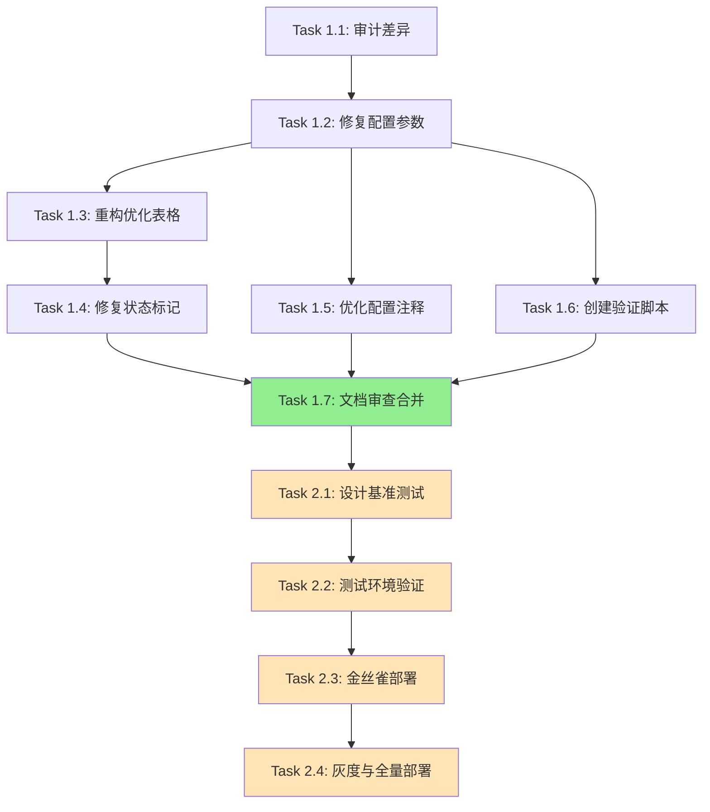

# Tasks: GPU锁文档与配置一致性审计

## 任务概述

本任务清单将 `audit-gpu-lock-consistency` 提案分解为可执行的小型工作项,按依赖顺序排列。

---

## Phase 1: 文档修复 (必须执行)

### Task 1.1: 审计文档与配置差异
**优先级**: P0 (Critical)
**预计时间**: 30 分钟
**依赖**: 无

**描述**:
系统性对比 `docs/technical/reference/GPU_LOCK_COMPLETE_GUIDE.md` 和 `config.yml`,记录所有不一致之处。

**执行步骤**:
1. 提取文档中所有配置参数值
2. 提取 `config.yml` 中对应的实际值
3. 生成差异报告 (Markdown 表格)

**验证标准**:
- [ ] 生成完整的差异对比表格
- [ ] 识别所有 4 个关键参数的差异
- [ ] 记录文档中的虚假状态标记

**产出物**:
- `openspec/changes/audit-gpu-lock-consistency/audit_report.md`

---

### Task 1.2: 修复配置参数文档
**优先级**: P0 (Critical)
**预计时间**: 1 小时
**依赖**: Task 1.1

**描述**:
更新文档中的所有配置参数值,使其与 `config.yml` 完全一致。

**执行步骤**:
1. 定位文档中的配置章节 (第 97-121 行)
2. 将所有配置值替换为实际值:
   - `poll_interval: 0.5` → `poll_interval: 2`
   - `max_wait_time: 300` → `max_wait_time: 1800`
   - `lock_timeout: 600` → `lock_timeout: 3600`
   - `max_poll_interval: 5` → `max_poll_interval: 10`
3. 更新配置注释,说明当前为"生产配置"

**验证标准**:
- [ ] 所有配置值与 `config.yml` 一致
- [ ] 注释清晰说明配置用途
- [ ] 通过自动化验证脚本

**产出物**:
- 更新后的 `GPU_LOCK_COMPLETE_GUIDE.md`

---

### Task 1.3: 重构优化历史表格
**优先级**: P0 (Critical)
**预计时间**: 45 分钟
**依赖**: Task 1.2

**描述**:
将虚假的"优化历史"表格改为"优化建议"表格,明确标记未验证状态。

**执行步骤**:
1. 定位文档中的优化历史表格 (第 123-131 行)
2. 修改表格结构:
   ```markdown
   # 修改前
   | 配置参数 | 优化前 | 优化后 | 改进幅度 |

   # 修改后
   | 配置参数 | 当前值 | 建议优化值 | 预期改进 | 验证状态 |
   ```
3. 为所有优化建议添加"⚠️ 待验证"标记
4. 添加警告说明: "以下优化尚未在生产环境验证"

**验证标准**:
- [ ] 表格包含"验证状态"列
- [ ] 所有优化标记为"待验证"
- [ ] 包含明确的警告说明

**产出物**:
- 更新后的优化建议表格

---

### Task 1.4: 修复实施状态标记
**优先级**: P0 (Critical)
**预计时间**: 30 分钟
**依赖**: Task 1.3

**描述**:
更新文档中的所有状态标记,准确反映实际实施情况。

**执行步骤**:
1. 定位文档顶部的状态标记 (第 10 行)
2. 修改为:
   ```markdown
   **文档状态**: ✅ GPU锁基础功能已集成
   **配置状态**: ⚠️ 使用保守配置,性能优化待验证
   ```
3. 定位文档末尾的实施状态 (第 795 行)
4. 修改为:
   ```markdown
   **实施状态**: 🔄 基础功能完成,优化配置待评估
   ```
5. 添加"下一步行动"章节,说明后续优化计划

**验证标准**:
- [ ] 移除所有虚假的"✅ 已完成并验证"标记
- [ ] 使用分级状态标记 (✅/🔄/⚠️)
- [ ] 包含"下一步行动"章节

**产出物**:
- 更新后的状态标记

---

### Task 1.5: 优化配置文件注释
**优先级**: P1 (High)
**预计时间**: 30 分钟
**依赖**: Task 1.2

**描述**:
为 `config.yml` 中的 GPU 锁配置添加清晰的注释,与文档保持一致。

**执行步骤**:
1. 定位 `config.yml` 中的 `gpu_lock` 配置块 (第 237-247 行)
2. 为每个参数添加注释:
   ```yaml
   gpu_lock:
     poll_interval: 2  # 轮询间隔(秒) - 当前生产配置
     # 优化建议: 可考虑降低至 0.5 秒以提升响应速度 (需性能测试验证)

     max_wait_time: 1800  # 最大等待时间(秒) - 30分钟
     # 优化建议: 可考虑降低至 300 秒 (需评估长任务影响)
   ```
3. 确保注释语言与文档一致 (中文)

**验证标准**:
- [ ] 所有配置项包含清晰注释
- [ ] 优化建议明确标记为"建议"
- [ ] 注释风格统一

**产出物**:
- 更新后的 `config.yml`

---

### Task 1.6: 创建自动化验证脚本
**优先级**: P1 (High)
**预计时间**: 1 小时
**依赖**: Task 1.2

**描述**:
创建自动化脚本,验证文档与配置的一致性,防止未来再次出现不一致。

**执行步骤**:
1. 创建验证脚本 `tests/validation/validate_gpu_lock_docs.sh`
2. 实现配置值提取和对比逻辑
3. 集成到 CI/CD 流程 (可选)

**验证标准**:
- [ ] 脚本能正确提取文档和配置中的值
- [ ] 能检测所有 4 个关键参数的不一致
- [ ] 返回清晰的错误信息

**产出物**:
- `tests/validation/validate_gpu_lock_docs.sh`
- CI 配置更新 (可选)

**参考实现**:
```bash
#!/bin/bash
set -e

DOC_FILE="docs/technical/reference/GPU_LOCK_COMPLETE_GUIDE.md"
CONFIG_FILE="config.yml"

params=("poll_interval" "max_wait_time" "lock_timeout" "max_poll_interval")

for param in "${params[@]}"; do
    doc_value=$(grep "$param:" "$DOC_FILE" | head -1 | grep -oP '\d+(\.\d+)?')
    config_value=$(grep -A 10 "^gpu_lock:" "$CONFIG_FILE" | grep "$param:" | grep -oP '\d+(\.\d+)?')

    if [ "$doc_value" != "$config_value" ]; then
        echo "❌ FAIL: $param 不一致"
        exit 1
    fi
done

echo "✅ 所有验证通过"
```

---

### Task 1.7: 文档审查与合并
**优先级**: P0 (Critical)
**预计时间**: 1 小时
**依赖**: Task 1.2, 1.3, 1.4, 1.5, 1.6

**描述**:
提交 PR,进行代码审查,合并到主分支。

**执行步骤**:
1. 创建 Git 分支: `fix/gpu-lock-doc-consistency`
2. 提交所有文档变更
3. 运行验证脚本确保通过
4. 创建 PR,附上差异报告
5. 至少 2 名团队成员审查
6. 合并到 `master` 分支

**验证标准**:
- [ ] 所有验证脚本通过
- [ ] 至少 2 名审查者批准
- [ ] 无合并冲突

**产出物**:
- Git PR 和合并记录

---

## Phase 2: 配置优化评估 (可选执行)

**注意**: 以下任务为可选,仅在 Phase 1 完成后,经过业务评估决定执行时才进行。

### Task 2.1: 设计性能基准测试
**优先级**: P2 (Medium)
**预计时间**: 4 小时
**依赖**: Phase 1 完成

**描述**:
设计全面的性能基准测试,验证优化配置的有效性。

**执行步骤**:
1. 定义测试场景 (短/中/长任务)
2. 实现基准测试框架
3. 创建测试数据集

**验证标准**:
- [ ] 覆盖所有 GPU 服务 (PaddleOCR, FFmpeg, Faster-Whisper)
- [ ] 包含并发测试场景
- [ ] 可重复执行

**产出物**:
- `tests/performance/test_gpu_lock_benchmark.py`

---

### Task 2.2: 测试环境验证
**优先级**: P2 (Medium)
**预计时间**: 1 天
**依赖**: Task 2.1

**描述**:
在测试环境应用优化配置,执行基准测试。

**执行步骤**:
1. 部署测试环境
2. 应用优化配置
3. 执行基准测试
4. 收集性能数据
5. 分析结果,生成报告

**验证标准**:
- [ ] 任务成功率 ≥ 95%
- [ ] 等待时间减少 ≥ 30%
- [ ] Redis CPU 增长 < 50%
- [ ] 超时率 < 5%

**产出物**:
- 性能测试报告

---

### Task 2.3: 生产环境金丝雀部署
**优先级**: P2 (Medium)
**预计时间**: 2 天
**依赖**: Task 2.2 (测试通过)

**描述**:
在 10% 的生产节点上应用优化配置,观察 24 小时。

**执行步骤**:
1. 选择金丝雀节点
2. 应用优化配置
3. 配置监控告警
4. 观察 24 小时
5. 收集生产数据

**验证标准**:
- [ ] 无 P0/P1 生产事故
- [ ] 关键指标正常
- [ ] 用户无投诉

**产出物**:
- 金丝雀部署报告

---

### Task 2.4: 灰度发布与全量部署
**优先级**: P2 (Medium)
**预计时间**: 3 天
**依赖**: Task 2.3 (金丝雀成功)

**描述**:
逐步扩大优化配置的覆盖范围,最终全量部署。

**执行步骤**:
1. 灰度发布 (50% 流量, 48 小时)
2. 全量发布 (100% 流量)
3. 持续监控 7 天
4. 更新文档为"✅ 已完成并验证"

**验证标准**:
- [ ] 全量部署 7 天无回滚
- [ ] 性能改进符合预期
- [ ] 文档更新完成

**产出物**:
- 部署报告
- 更新后的文档

---

## 任务依赖关系图



**图例**:
- 绿色: Phase 1 关键里程碑
- 浅橙色: Phase 2 可选任务

---

## 并行执行建议

以下任务可并行执行以提高效率:

### 并行组 1 (Phase 1)
- Task 1.2 (修复配置参数)
- Task 1.5 (优化配置注释)
- Task 1.6 (创建验证脚本)

**原因**: 这三个任务操作不同文件,无冲突。

### 并行组 2 (Phase 2)
- 无 (Phase 2 任务必须顺序执行)

---

## 时间估算

### Phase 1 (必须执行)
- **最短路径**: 4 小时 (单人顺序执行)
- **并行执行**: 2.5 小时 (2 人并行)
- **包含审查**: 5 小时 (含 PR 审查时间)

### Phase 2 (可选执行)
- **测试与部署**: 6-7 天 (含观察期)

---

## 风险与缓解

| 任务 | 风险 | 缓解措施 |
|------|------|---------|
| Task 1.2 | 遗漏配置参数 | 使用验证脚本自动检查 |
| Task 1.7 | 审查延迟 | 提前通知审查者,准备详细的变更说明 |
| Task 2.2 | 测试环境不稳定 | 使用生产数据副本,确保环境一致性 |
| Task 2.3 | 金丝雀节点选择不当 | 选择低峰时段,准备快速回滚方案 |

---

## 成功标准总结

### Phase 1 完成标准
- [ ] 所有文档配置值与 `config.yml` 一致
- [ ] 移除所有虚假状态标记
- [ ] 自动化验证脚本通过
- [ ] 至少 2 名团队成员审查通过
- [ ] 合并到主分支

### Phase 2 完成标准 (可选)
- [ ] 测试环境验证通过
- [ ] 金丝雀部署 24 小时无异常
- [ ] 全量部署 7 天无回滚
- [ ] 性能改进符合预期 (等待时间 ↓ ≥ 30%)

---

**任务清单作者**: Claude AI
**创建日期**: 2025-12-24
**预计总时间**: Phase 1 (5小时) + Phase 2 (6-7天,可选)
