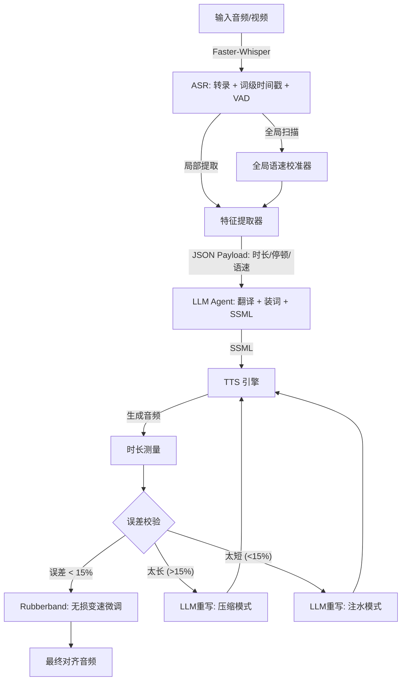

# S2ST 智能装词系统设计方案 (V2.0 最终版)

## 1. 系统架构概览

我们将传统的串行处理升级为**带反馈的控制环路**。



---

## 2. 核心模块详解与代码实现

### 模块一：特征提取 (The Eyes)

**输入**：`faster-whisper` 的原始 segments。
**输出**：包含精准时长、语速建议、强制停顿点的 JSON。

```python
import re
from dataclasses import dataclass

@dataclass
class LanguageProfile:
    code: str
    std_pace: float  # 标准语速 (char/sec 或 word/sec)
    script_type: str # 'latin', 'cjk' (中日韩)

# 语言物理常数配置
LANG_CONFIG = {
    "en": LanguageProfile("en", 15.0, "latin"),
    "zh": LanguageProfile("zh", 3.8, "cjk"),
    # 可扩展 ja, ko 等
}

class S2STAnalyzer:
    def __init__(self, lang="en"):
        self.config = LANG_CONFIG.get(lang, LANG_CONFIG["en"])
        self.global_speed_factor = 1.0

    def calibrate_global_speed(self, all_segments):
        """全局校准：判断视频是否倍速播放"""
        total_chars = 0
        total_dur = 0
        for seg in all_segments:
            dur = seg.end - seg.start
            if dur > 1.0:
                text_len = len(seg.text.replace(" ", "")) if self.config.script_type == "cjk" else len(seg.text)
                total_chars += text_len
                total_dur += dur

        if total_dur > 0:
            avg_pace = total_chars / total_dur
            self.global_speed_factor = avg_pace / self.config.std_pace
            print(f"[Calibration] Global Speed Factor: {self.global_speed_factor:.2f}x")

    def analyze(self, segment):
        """局部提取：生成单句约束"""
        words = segment.words # 依赖 faster-whisper word_timestamps=True
        text = segment.text.strip()

        if not words:
            return None

        # 1. 精准时长 (基于首尾词，排除 Segment 两端静音)
        start = words[0].start
        end = words[-1].end
        duration = round(end - start, 2)

        # 2. 语速密度分析 (相对于全局倍率)
        char_count = len(text.replace(" ", "")) if self.config.script_type == "cjk" else len(text)
        current_pace = char_count / duration if duration > 0 else 0
        relative_ratio = (current_pace / self.config.std_pace) / self.global_speed_factor

        pace_hint = "Normal"
        if relative_ratio > 1.4:
            pace_hint = "Fast/Burst (Concise translation)"
        elif relative_ratio < 0.7:
            pace_hint = "Slow/Drawling (Use fillers)"

        # 3. 强制停顿检测 (用于生成 SSML Breaks)
        breaks = []
        for i in range(len(words) - 1):
            gap = words[i+1].start - words[i].end
            if gap > 0.35: # 350ms 阈值
                breaks.append({
                    "after_word": words[i].word.strip(),
                    "duration_ms": int(gap * 1000)
                })

        return {
            "id": segment.id,
            "text": text,
            "constraints": {
                "target_duration": duration,
                "pace_hint": pace_hint,
                "required_breaks": breaks,
                "global_speed": f"{self.global_speed_factor:.1f}x"
            }
        }

```

---

### 模块二：LLM Agent (The Brain)

**核心变革**：要求 LLM 输出 **SSML** 而非纯文本。

#### System Prompt 设计

```markdown
# Role

You are a professional Dubbing Director for S2ST systems.
Your goal is to translate source text into **Chinese (Mandarin)**, wrapped in **SSML** tags, to perfectly match the target duration.

# Input Data

You will receive:

1. `text`: Source text.
2. `target_duration`: The EXACT time window (seconds).
3. `pace_hint`: Speed instruction (Normal/Fast/Slow).
4. `required_breaks`: Pauses that MUST exist in the output.

# Rules for Script Adaptation (装词)

1. **Isochrony is King**:
    - If `pace_hint` is "Slow", you MUST expand the text using fillers (e.g., "那个", "其实", "也就是说") or particles (呢, 啊, 呀).
    - If `pace_hint` is "Fast", you MUST condense the text (use idioms, drop pronouns).
2. **SSML Requirements**:
    - You MUST output valid `<speak>` tags.
    - You MUST map `required_breaks` to `<break time="Xms"/>` at the corresponding logical position in Chinese.
    - Use `<prosody rate="X">` only if necessary to fine-tune speed (range 0.8 to 1.2).

# Output Format (JSON Only)

{
"rationale": "Brief reasoning about length strategy.",
"ssml": "<speak>Translated text...</speak>",
"estimated_duration": 0.0
}
```

#### User Prompt 模板

```json
{
    "text": "Well, little kitty, [PAUSE] if you really want to catch flies...",
    "constraints": {
        "target_duration": 5.2,
        "pace_hint": "Slow/Drawling",
        "required_breaks": [{ "after_word": "kitty,", "duration_ms": 400 }]
    }
}
```

#### LLM 预期输出

```json
{
    "rationale": "Source is slow (5.2s). Need to expand. Added '那个...我说' and '呀' to fill time. Inserted break after 'kitty'.",
    "ssml": "<speak><prosody rate=\"0.9\">那个……我说小猫咪呀，</prosody><break time=\"400ms\"/>如果你真心想要去抓苍蝇的话……</speak>",
    "estimated_duration": 5.2
}
```

---

### 模块三：闭环执行与音频后处理 (The Mouth)

这是保证质量的最后一道防线。

```python
import subprocess

class AudioSynthesizer:
    def __init__(self, tts_engine):
        self.tts = tts_engine

    def process_segment(self, segment_data, llm_agent, max_retries=2):
        target_dur = segment_data["constraints"]["target_duration"]

        # 1. 初始生成
        response = llm_agent.generate(segment_data)

        for attempt in range(max_retries + 1):
            ssml = response["ssml"]

            # 2. TTS 合成 (必须支持 SSML)
            raw_audio_path = self.tts.synthesize(ssml)
            raw_dur = self.get_duration(raw_audio_path)

            # 3. 计算偏差
            ratio = raw_dur / target_dur

            # 4. 决策逻辑
            if 0.85 <= ratio <= 1.15:
                # 命中甜点区间：物理变速
                return self.time_stretch(raw_audio_path, ratio) # ratio > 1 means compress

            # 偏差过大，需要 LLM 重写
            if ratio > 1.15:
                feedback = f"Too Long! Current: {raw_dur}s, Target: {target_dur}s. Condense text!"
                response = llm_agent.retry(feedback, mode="condense")
            elif ratio < 0.85:
                feedback = f"Too Short! Current: {raw_dur}s, Target: {target_dur}s. Expand text!"
                response = llm_agent.retry(feedback, mode="expand")

        # 5. 兜底：如果重试多次仍失败，强制变速并记录警告
        print(f"[Warn] Segment {segment_data['id']} failed convergence. Forcing stretch.")
        return self.time_stretch(raw_audio_path, raw_dur / target_dur)

    def time_stretch(self, audio_path, ratio):
        """
        使用 Rubberband 进行高质量时间拉伸 (比 atempo 音质好)
        ratio: 目标时长缩放比例
        """
        # rubberband 命令行工具: rubberband -t <ratio> input.wav output.wav
        # 注意: rubberband 的 -t 参数定义是 stretch factor.
        # 如果音频 10s, 目标 5s. ratio=0.5 (变快). rubberband -t 0.5
        output_path = audio_path.replace(".wav", "_final.wav")
        cmd = ["rubberband", "-t", str(1/ratio), audio_path, output_path] # ffmpeg atempo逻辑相反，需注意库的区别
        subprocess.run(cmd)
        return output_path

    def get_duration(self, path):
        # 使用 ffprobe 获取时长
        return float(subprocess.check_output(["ffprobe", "-v", "error", "-show_entries", "format=duration", "-of", "default=noprint_wrappers=1:nokey=1", path]))

```

---

## 3. 为什么这个方案优于你之前的方案？

| 维度         | 旧方案 (Your V1)           | **最终方案 (My V2)**                  | 收益                                   |
| ------------ | -------------------------- | ------------------------------------- | -------------------------------------- |
| **特征输入** | 原始词级时间戳             | **Feature Analyzer** (时长+语速+停顿) | 减少 Token 消耗，LLM 更易理解          |
| **翻译控制** | 纯文本 + 标点              | **SSML 标记语言**                     | 精确控制句内停顿和韵律，不再“瞎猜”     |
| **时长对齐** | 单次生成 + FFmpeg 强制拉伸 | **生成 -> 测量 -> 重写 -> 微调**      | 避免 2x 变速导致的“花栗鼠音效”         |
| **语速适应** | 固定字数规则               | **全局校准 + 相对密度**               | 完美适配 TikTok 快语速或教程慢语速     |
| **鲁棒性**   | 无重试机制                 | **偏差 >15% 自动重写**                | 解决长尾 Case (极长/极短句) 的翻车问题 |

## 4. 下一步行动建议

1. **准备环境**：安装 `faster-whisper`, `ffmpeg` (含 `rubberband` 库)。
2. **TTS 选型**：

-   **最佳**：Azure Speech Service 或 OpenAI TTS (支持 SSML，效果自然)。
-   **开源**：VITS 或 Edge-TTS (Edge-TTS 支持部分 SSML，免费且效果不错)。

3. **开发 Feature Analyzer**：直接复制上面的 Python 代码，接入你的 `faster-whisper` 结果进行测试，看看提取出的 `pace_hint` 是否符合体感。

这套方案在工程上是完全闭环的，既利用了 LLM 的推理能力处理“装词”，又利用了传统 DSP (数字信号处理) 技术保证最终的对齐精度。
