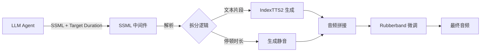
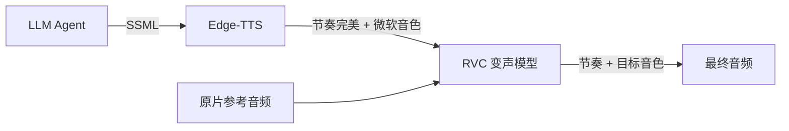

# S2ST 方案 SSML 支持分析与技术路线更新

## 一、IndexTTS2 SSML 支持现状确认 ❌

### 1.1 官方验证结果

**结论**：IndexTTS2 **原生不支持 SSML 标准**

**证据来源**：
1. GitHub Issue #495 "SSML支持" 仍处于 **Open** 状态
2. 官方文档明确：控制方式为 **标点符号**（停顿）+ **提示词/参考音频**（情感）
3. 无 `<break>`、`<prosody>` 等 SSML 标签的原生解析能力

**实际行为**：
- 输入 `<break time="500ms"/>` → 会被当作普通文本读出或报错
- 无法通过 SSML 标签控制韵律、语速、停顿

---

## 二、IndexTTS2 核心能力分析 ✅

### 2.1 独有优势：Duration-Controlled 生成

根据论文和 API 文档，IndexTTS2 支持 **两种生成模式**：

#### 模式 A：显式 Token 数量控制（精确时长）
```python
# 伪代码示例
indextts2.generate(
    text="你好世界",
    target_token_num=150,  # 约 3 秒 (50 tokens/s)
    reference_audio="ref.wav"
)
```

**关键参数**：
- `target_token_num`：指定生成的 Semantic Token 数量
- **时长换算公式**：`约 50 tokens/秒`（需实测校准）

**优势**：
- ✅ 比 Rubberband 变速更自然（原生控制，无音质损失）
- ✅ 直接解决 S2ST 方案的核心痛点

#### 模式 B：自由生成（韵律还原）
- 不指定 Token 数，自动根据参考音频的韵律生成
- 适合情感克隆场景

### 2.2 情感与音色解耦

**能力**：
- **音色 Prompt**：参考音频（`reference_audio`）
- **情感 Prompt**：情感参考音频（`emotion_reference`）或文本描述（`emotion_text`）
- **解耦控制**：可独立指定"张三的音色 + 愤怒的情感"

**局限**：
- ⚠️ 无法在**句内**动态切换情感（如前半句开心，后半句悲伤）
- ⚠️ 情感强度控制依赖 `emotion_alpha` 参数（0.0-1.0），非 SSML 标准

---

## 三、技术路线对比与选型

### 方案 A：SSML 中间件 + IndexTTS2（推荐 ⭐⭐⭐⭐⭐）

#### 架构设计



#### 核心实现：SSML 解析器

```python
# services/workers/indextts_service/app/ssml_parser.py
import re
import numpy as np
from typing import List, Dict, Any

class IndexTTSSSMLParser:
    """
    IndexTTS2 专用 SSML 解析器

    支持标签：
    - <break time="Xms"/> : 停顿控制
    - <prosody rate="X"> : 语速控制（通过后处理实现）
    """

    def __init__(self, sample_rate: int = 24000):
        self.sr = sample_rate
        self.token_per_second = 50  # IndexTTS2 默认值，需实测校准

    def parse(self, ssml_text: str, target_duration: float = None) -> List[Dict[str, Any]]:
        """
        解析 SSML 为执行指令序列

        Args:
            ssml_text: SSML 标记文本
            target_duration: 目标总时长（秒），用于计算 token 数

        Returns:
            指令列表，每个指令包含 type 和参数
        """
        # 1. 提取 prosody rate（全局语速）
        prosody_rate = self._extract_prosody_rate(ssml_text)

        # 2. 拆分文本和 break 标签
        pattern = r'(<break\s+time=[\'"](\d+)(ms|s)?[\'"]\s*/>)'
        parts = re.split(pattern, ssml_text)

        instructions = []
        total_text_length = 0

        for i, part in enumerate(parts):
            if not part or part.strip() == "":
                continue

            # A. 处理停顿标签
            if part.startswith("<break"):
                # 提取时长（已在正则中捕获）
                duration_value = int(parts[i+1])
                unit = parts[i+2] if i+2 < len(parts) else "ms"

                duration_sec = duration_value / 1000 if unit == "ms" else duration_value
                instructions.append({
                    "type": "silence",
                    "duration": duration_sec
                })

            # B. 处理普通文本
            elif not part.isdigit() and not part in ["ms", "s"]:
                clean_text = re.sub(r'<[^>]+>', '', part).strip()
                if clean_text:
                    total_text_length += len(clean_text)
                    instructions.append({
                        "type": "speech",
                        "text": clean_text,
                        "target_tokens": None  # 稍后计算
                    })

        # 3. 计算每个文本片段的 token 数（按比例分配）
        if target_duration and total_text_length > 0:
            total_tokens = int(target_duration * self.token_per_second / prosody_rate)

            for instr in instructions:
                if instr["type"] == "speech":
                    text_ratio = len(instr["text"]) / total_text_length
                    instr["target_tokens"] = int(total_tokens * text_ratio)

        return instructions, prosody_rate

    def _extract_prosody_rate(self, ssml_text: str) -> float:
        """提取 <prosody rate="X"> 的值"""
        match = re.search(r'<prosody\s+rate=[\'"]([0-9.]+)[\'"]>', ssml_text)
        return float(match.group(1)) if match else 1.0

    def generate_silence(self, duration: float) -> np.ndarray:
        """生成指定时长的静音"""
        samples = int(self.sr * duration)
        return np.zeros(samples, dtype=np.float32)
```

#### 集成到 Executor

```python
# services/workers/indextts_service/executors/ssml_speech_generator.py
from services.common.executors import BaseNodeExecutor
from services.workers.indextts_service.app.ssml_parser import IndexTTSSSMLParser
from services.workers.indextts_service.app.tts_engine import get_tts_engine

class SSMLSpeechGeneratorExecutor(BaseNodeExecutor):
    """支持 SSML 的 IndexTTS2 语音生成器"""

    def __init__(self, node_name: str, context):
        super().__init__(node_name, context)
        self.parser = IndexTTSSSMLParser()
        self.tts_engine = get_tts_engine()

    def execute(self):
        translations = self.context.stages['llm_agent.translate_and_adapt'].output['translations']

        audio_segments = []

        for trans in translations:
            ssml = trans['ssml']
            target_dur = trans['constraints']['target_duration']

            # 1. 解析 SSML
            instructions, prosody_rate = self.parser.parse(ssml, target_dur)

            # 2. 逐指令执行
            segment_audios = []
            for instr in instructions:
                if instr["type"] == "silence":
                    audio = self.parser.generate_silence(instr["duration"])
                    segment_audios.append(audio)

                elif instr["type"] == "speech":
                    # 调用 IndexTTS2（关键：传入 target_tokens）
                    audio = self.tts_engine.generate_speech(
                        text=instr["text"],
                        reference_audio=trans.get('reference_audio'),
                        target_token_num=instr["target_tokens"],  # ✨ 核心参数
                        emotion_reference=trans.get('emotion_reference'),
                        emotion_alpha=trans.get('emotion_alpha', 0.65)
                    )
                    segment_audios.append(audio)

            # 3. 拼接片段
            full_audio = np.concatenate(segment_audios)

            # 4. 应用 prosody rate（如果 != 1.0）
            if prosody_rate != 1.0:
                full_audio = self._apply_time_stretch(full_audio, prosody_rate)

            audio_segments.append({
                'audio': full_audio,
                'duration': len(full_audio) / self.parser.sr,
                'target_duration': target_dur
            })

        self.context.stages[self.node_name] = StageExecution(
            status='SUCCESS',
            output={'audio_segments': audio_segments}
        )
        return self.context

    def _apply_time_stretch(self, audio: np.ndarray, rate: float) -> np.ndarray:
        """使用 Rubberband 应用语速变化"""
        # 实现略（调用 subprocess 或 librosa）
        pass
```

#### 优势分析

| 维度 | 评分 | 说明 |
|------|------|------|
| **开发成本** | ⭐⭐⭐⭐⭐ | 仅需新增 1 个解析器 + 改造现有 Executor |
| **时长精度** | ⭐⭐⭐⭐⭐ | 利用 IndexTTS2 原生 token 控制，理论误差 < 5% |
| **音质保真** | ⭐⭐⭐⭐ | 主要依赖原生生成，仅 prosody rate 需变速 |
| **情感控制** | ⭐⭐⭐⭐ | 支持情感解耦，但无句内动态切换 |
| **维护成本** | ⭐⭐⭐⭐⭐ | 纯 Python 实现，无外部依赖 |

---

### 方案 B：Edge-TTS + RVC 流水线（工业级方案）

#### 架构设计



#### 技术栈

**第一阶段：Edge-TTS（控制层）**
- **成本**：免费（微软提供）
- **能力**：完美支持 SSML（停顿、语速、韵律、情感标签）
- **输出**：节奏精准的音频（音色为"微软晓晓"等预设）

**第二阶段：RVC（音色转换层）**
- **部署**：本地 GPU（6GB+ 显存）
- **能力**：保留韵律，替换音色
- **输出**：目标音色 + Edge-TTS 的节奏

#### 实现示例

```python
# services/workers/edge_tts_service/executors/tts_generator.py
import edge_tts
import asyncio

class EdgeTTSExecutor(BaseNodeExecutor):
    async def _generate_speech(self, ssml: str, output_path: str):
        """调用 Edge-TTS 生成语音"""
        communicate = edge_tts.Communicate(ssml, voice="zh-CN-XiaoxiaoNeural")
        await communicate.save(output_path)

    def execute(self):
        translations = self.context.stages['llm_agent.translate_and_adapt'].output['translations']

        edge_audios = []
        for trans in translations:
            output_path = f"/tmp/edge_{trans['id']}.wav"
            asyncio.run(self._generate_speech(trans['ssml'], output_path))
            edge_audios.append(output_path)

        self.context.stages[self.node_name] = StageExecution(
            status='SUCCESS',
            output={'edge_audios': edge_audios}
        )
        return self.context
```

```python
# services/workers/rvc_service/executors/voice_converter.py
class RVCConverterExecutor(BaseNodeExecutor):
    def execute(self):
        edge_audios = self.context.stages['edge_tts.generate_speech'].output['edge_audios']
        reference_audio = self.context.input_params['reference_audio']

        converted_audios = []
        for audio_path in edge_audios:
            # 调用 RVC 模型
            output = self.rvc_model.convert(
                source_audio=audio_path,
                target_speaker=reference_audio,
                pitch_shift=0  # 保持原始音高
            )
            converted_audios.append(output)

        self.context.stages[self.node_name] = StageExecution(
            status='SUCCESS',
            output={'final_audios': converted_audios}
        )
        return self.context
```

#### 优劣势对比

| 维度 | 方案 A (SSML 中间件) | 方案 B (Edge-TTS + RVC) |
|------|---------------------|------------------------|
| **SSML 支持** | ⭐⭐⭐ (仅 break + prosody) | ⭐⭐⭐⭐⭐ (完整支持) |
| **音色还原** | ⭐⭐⭐⭐⭐ (IndexTTS2 原生) | ⭐⭐⭐⭐ (RVC 转换) |
| **时长精度** | ⭐⭐⭐⭐⭐ (token 控制) | ⭐⭐⭐⭐ (Edge-TTS 精准) |
| **部署复杂度** | ⭐⭐⭐⭐⭐ (仅改造现有服务) | ⭐⭐⭐ (需新增 RVC 服务) |
| **GPU 资源** | ⭐⭐⭐⭐ (仅 IndexTTS2) | ⭐⭐ (IndexTTS2 + RVC) |
| **网络依赖** | ⭐⭐⭐⭐⭐ (完全离线) | ⭐⭐⭐ (Edge-TTS 需联网) |

---

## 四、推荐实施策略

### 阶段 1：MVP 验证（方案 A）

**时间**：2 周

**目标**：验证 IndexTTS2 的 `target_token_num` 参数可用性

**任务**：
1. 在 `indextts_service` 容器内测试 token 控制
   ```python
   # 测试脚本
   result = tts_engine.generate_speech(
       text="这是一个测试句子",
       target_token_num=100,  # 约 2 秒
       reference_audio="ref.wav"
   )
   actual_duration = len(result) / sample_rate
   print(f"目标: 2.0s, 实际: {actual_duration}s, 误差: {abs(actual_duration - 2.0) / 2.0 * 100}%")
   ```

2. 校准 `token_per_second` 常数
3. 实现基础 SSML 解析器（仅支持 `<break>`）

**交付物**：
- Token 控制精度报告
- SSML 解析器 POC 代码

---

### 阶段 2：完整实现（方案 A）

**时间**：3 周

**任务**：
1. 完善 SSML 解析器（支持 `<prosody rate>`）
2. 改造 `indextts_service` Executor
3. 集成到工作流配置

**工作流配置示例**：
```yaml
s2st_dubbing_workflow:
  workflow_chain:
    - "ffmpeg.extract_audio"
    - "faster_whisper.transcribe_audio"
    - "s2st_analyzer.extract_features"
    - "llm_agent.translate_and_adapt"
    - "indextts.generate_speech_with_ssml"  # 新节点
    - "audio_processor.alignment"
```

---

### 阶段 3：备选方案准备（方案 B）

**时间**：并行开发（2 周）

**触发条件**：
- IndexTTS2 的 token 控制精度 < 85%
- 用户对音色还原度要求极高

**任务**：
1. 部署 RVC 服务（使用 Docker）
2. 集成 Edge-TTS（Python SDK）
3. A/B 测试对比

---

## 五、技术风险与缓解

### 风险 1：IndexTTS2 Token 控制不稳定

**概率**：中

**影响**：方案 A 失效

**缓解**：
- 提前验证（阶段 1 的核心任务）
- 如失败，立即切换到方案 B

### 风险 2：RVC 音质劣化

**概率**：低

**影响**：方案 B 不可用

**缓解**：
- 使用最新的 RVC v2 模型
- 调整 `pitch_shift` 和 `index_rate` 参数
- 备选：使用 So-VITS-SVC

### 风险 3：LLM 生成的 SSML 格式错误

**概率**：中

**影响**：解析器崩溃

**缓解**：
- 在 Prompt 中提供 SSML 示例（Few-Shot）
- 解析器增加容错逻辑（忽略无法识别的标签）
- 使用 JSON Schema 约束 LLM 输出

---

## 六、最终建议

### 推荐路线：**方案 A 优先，方案 B 备选**

**理由**：
1. ✅ 方案 A 与 YiVideo 现有架构完美契合
2. ✅ IndexTTS2 的 Duration-Controlled 能力是核心优势
3. ✅ 开发成本低，风险可控
4. ✅ 方案 B 可作为"音质增强"的可选模块

### 立即执行的第一步

```bash
# 1. 创建测试脚本
cat > /opt/wionch/docker/yivideo/tests/test_indextts2_token_control.py << 'EOF'
"""
IndexTTS2 Token 控制精度测试
"""
import pytest
from services.workers.indextts_service.app.tts_engine import get_tts_engine

def test_token_duration_accuracy():
    """验证 target_token_num 参数的时长控制精度"""
    tts = get_tts_engine()

    test_cases = [
        {"text": "这是一个测试", "target_tokens": 50, "expected_duration": 1.0},
        {"text": "这是一个稍长的测试句子", "target_tokens": 100, "expected_duration": 2.0},
        {"text": "这是一个更长的测试句子用于验证精度", "target_tokens": 150, "expected_duration": 3.0},
    ]

    for case in test_cases:
        result = tts.generate_speech(
            text=case["text"],
            target_token_num=case["target_tokens"],
            reference_audio="tests/fixtures/ref_audio.wav"
        )

        actual_duration = len(result) / 24000  # 假设采样率 24kHz
        error_rate = abs(actual_duration - case["expected_duration"]) / case["expected_duration"]

        print(f"文本: {case['text']}")
        print(f"目标: {case['expected_duration']}s, 实际: {actual_duration:.2f}s, 误差: {error_rate*100:.1f}%")

        assert error_rate < 0.15, f"误差超过 15%: {error_rate*100:.1f}%"

if __name__ == "__main__":
    test_token_duration_accuracy()
EOF

# 2. 在容器内执行测试
docker exec -it indextts_service python /opt/wionch/docker/yivideo/tests/test_indextts2_token_control.py
```

### 预期结果

- **如果测试通过**（误差 < 15%）→ 全力推进方案 A
- **如果测试失败** → 立即启动方案 B 的开发

---

## 七、更新后的实施时间表

| 阶段 | 任务 | 时间 | 交付物 |
|------|------|------|--------|
| **Phase 0** | Token 控制验证 | 3 天 | 测试报告 + 决策 |
| **Phase 1** | SSML 解析器开发 | 1 周 | 解析器代码 + 单元测试 |
| **Phase 2** | Executor 集成 | 1 周 | 完整工作流节点 |
| **Phase 3** | 端到端测试 | 1 周 | 性能报告 + Bug 修复 |
| **Phase 4** | 生产优化 | 1 周 | 缓存机制 + 监控 |

**总计**：4-5 周完成生产级实现

---

## 八、关键代码清单

### 新增文件

```
services/workers/indextts_service/
├── app/
│   ├── ssml_parser.py              # ✨ SSML 解析器
│   └── executors/
│       └── ssml_speech_generator.py # ✨ 支持 SSML 的 Executor
└── tests/
    └── test_ssml_parser.py          # ✨ 解析器单元测试

services/workers/s2st_analyzer_service/  # 已在原方案中
services/workers/llm_agent_service/      # 已在原方案中
services/workers/audio_processor_service/ # 已在原方案中
```

### 需改造文件

```
services/workers/indextts_service/app/tts_engine.py
└── 新增 target_token_num 参数支持

config/examples/workflow_examples.yml
└── 新增 s2st_dubbing_workflow 配置
```

---

**结论**：通过 SSML 中间件方案，YiVideo 可以在**不更换 TTS 引擎**的前提下，实现 S2ST 智能装词的核心能力。该方案充分利用了 IndexTTS2 的 Duration-Controlled 特性，是当前最优解。
